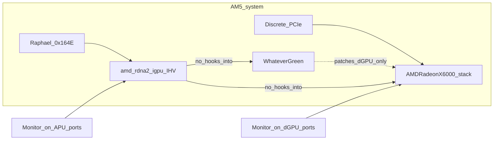

# CURSOR-START-AMD-RDNA2-IGPU — NootedRed-gap RDNA2 APU backend

**Audience:** Cursor coding agents filling `ihv/amd-rdna2-igpu/`.  
**Product:** display scanout + Metal on AMD **RDNA2 iGPUs** that NootedRed does not support — first board **Ryzen 7000 Raphael** (7950X3D / 7950X / siblings).  
**This file:** RDNA2-iGPU-only starter. Shares host contracts with [CURSOR-START-AMD.md](CURSOR-START-AMD.md). Do not rewrite `host/`.  
**Date:** 3 Sep 2026.

**Hard rules.** Architecture and implementation plan only. No SIP / OpenCore / AuxKC / unsigned-kext recipes. No Lilu / NootedRed / WhateverGreen *patch recipes* (coexistence with a stock WhateverGreen install is **required** — §2.1). No X6000 personality spoof onto Raphael DID `0x164E`. If a selector, entitlement, bundle ID, IOGPU method, PM4 opcode, or firmware RPC is not in the research corpus, a public header you have opened, or a URL cited here, write **UNKNOWN** and stop that branch.

---

## 1. Goal

Build an **unofficial IHV-quality GPU stack** so the **Raphael RDNA2 iGPU** (and later Rembrandt) can do **display + Metal** on a Hackintosh-on-AMD-APU machine where kexts can be loaded for development — **alongside WhateverGreen and any discrete GPUs** that own their own connectors.

**Done** = WindowServer desktop on whichever GPU has the active monitor cable(s); `MTLCopyAllDevices()` can return **both** our iGPU and a discrete Metal device; WhateverGreen remains loaded and continues to service the dGPU. Spoofing Raphael as Navi 21 so `AMDRadeonX6000` attaches, extending NootedRed with Lilu patches, requiring `-wegnoegpu`, or requiring removal of WhateverGreen are **not-done**.

**Stance:** Hard, but closer than RDNA3 dGPU in one respect: Apple’s live discrete Metal stack **is** RDNA2 (`AMDRadeonX6000`). The new work is **APU form factor** (UMA, DCN 3.1.5, 2 CU, APU match) plus **multi-GPU hygiene** (narrow match, no global AMD hooks). Still a **new IHV backend** — APU DCN/UMA ≠ Navi 21 FB.

---

## 2. Why this section (NootedRed gap)

NootedRed is the existing community kext for AMD **iGPU** acceleration on Hackintosh. Its published compatibility is the **Vega Raven / GCN 5** APU family (Ryzen 1xxx–5xxx and the **7x30** parts that reused GCN 5) ([ChefKiss NootedRed](https://chefkiss.dev/applehax/nootedred/)).

Maintainer statement on Raphael / 7950X ([NootedRed discussion #345](https://github.com/ChefKissInc/NootedRed/discussions/345)):

> The only Ryzen 7000 series that is supported by NootedRed is the 7030 series, as they reused the GCN 5 APUs on that one. The others are RDNA 2. RDNA 2 is not supported by NootedRed yet.

| AMD part | Arch | NootedRed | This IHV |
|---|---|---|---|
| Ryzen 1xxx–5xxx APUs, **7x30** | GCN 5 / Vega | In scope for NootedRed | **Out** — do not duplicate |
| **Raphael** Ryzen 7000 AM5 iGPU (7950X3D, …) | **RDNA2** `gfx1036` | **Unsupported** | **First target** |
| Rembrandt Ryzen 6000 mobile | RDNA2 `gfx1035` | Unsupported | Later sibling |
| Phoenix / Hawk Point 700M | RDNA3 `gfx1103` | Unsupported | Not this folder |
| Strix Point 800M | RDNA 3.5 `gfx115x` | Unsupported | `ihv/amd-rdna35-igpu/` |

**“Similar in style to NootedRed”** means: purpose-built AMD **iGPU** enablement on AMD platforms, FB then Metal, honest identity. It does **not** mean forking NootedRed or patching Apple AMD kexts. Product shape matches this repo’s other IHV slots (FB kext + accelerator kext + `*MTLDriver.bundle`).

### 2.1 WhateverGreen + discrete GPU coexistence (hard product requirement)

NootedRed’s published install rules **reject** this product shape: remove WhateverGreen; do not leave a GCN5/RDNA AMD dGPU enabled (`-wegnoegpu` / `disable-gpu`) ([NootedRed docs](https://chefkiss.dev/applehax/nootedred/)). **This IHV must invert those constraints.**

| Constraint | NootedRed | This IHV |
|---|---|---|
| WhateverGreen loaded | Conflict — remove WEG | **Required compatible** — WEG stays for dGPU AGDP/connector/etc. |
| Discrete GPU present | Conflict — disable dGPU | **Required compatible** — dGPU keeps its own FB/Metal path |
| Match scope | Mixes X5000/X6000 paths for iGPU | **Raphael DID only** (`0x164E`; Rembrandt later) — never claim other AMD DIDs |
| Global AMD hooks | Lilu patches into Apple AMD stack | **None** — no Lilu, no WEG patch sites, no Apple AMD binary patches |
| Primary display | iGPU-centric (dGPU off) | **Connector-driven** — see below |

**Primary display policy (locked): connector-driven.** Whichever GPU has the active monitor cable(s) owns that display / WindowServer head. No forced “iGPU primary” or “dGPU primary.” If the cable is on the discrete card, that card’s FB (Apple X6000 + WEG, or another IHV) is primary; if the cable is on the motherboard/APU outputs, our Raphael FB is primary; both may be active when monitors are on both.

**Architectural rules that make coexistence work:**

1. **Narrow `match/`** — attach only to Raphael (and later Rembrandt) identity. Never `IOPCIPrimaryMatch` wildcards that catch Navi/RX dGPUs.  
2. **No shared Apple AMD personality** — do not inject into `AMDRadeonX6000*` / `AMDRadeonX5000*` Info.plist paths used by the discrete card.  
3. **No Lilu plugin** — product kexts are standalone IOKit drivers behind `host/`. WEG may patch Apple dGPU kexts; we must not race those patch points.  
4. **Independent registry trees** — our accelerator / FB / `MetalPluginName` live only under the iGPU nub. Discrete card’s `MetalPluginName` and AGDP properties remain untouched.  
5. **Multi-device Metal** — after R5, `MTLCopyAllDevices()` may list both GPUs. Apps pick a device; we do not steal `CGDirectDisplayCopyCurrentMetalDevice` from a display we do not drive.  
6. **Do not require** `-wegnoegpu`, `-wegnoigpu`, or removing `WhateverGreen.kext`. Document that WEG’s dGPU flags remain the user’s responsibility for *their* discrete card — we neither depend on nor forbid them beyond “do not disable the iGPU if you want this backend.”

**Reference dual-GPU board for acceptance:** Lab evidence already includes **7950X3D-class Raphael + RTX 5080** (Nvidia, no Metal) with unaccelerated Monterey iGPU boot — see [boards.md](../ihv/amd-rdna2-igpu/docs/boards.md). For WEG + dual-`MTLDevice` acceptance, add or borrow an **Apple-supported AMD discrete (RX 6000-class)** with stock WhateverGreen. Unsupported companions (RTX 5080) must **not** break iGPU attach; their own acceleration stays out of this slot’s scope.

### 2.2 Lab evidence (Monterey, unaccelerated)

Reporter: Raphael iGPU booted **macOS Monterey without acceleration**; **System Information → Graphics** listed the **iGPU and an RTX 5080**.

| What it proves | What it does not prove |
|---|---|
| iGPU PCI/IOKit identity is visible to macOS | Acceleration / Metal / our kext |
| Unaccelerated desktop on APU path is achievable (GOP/basic FB) | DCN 3.1.5 programmed by a proper `IOFramebuffer` |
| Nvidia dGPU can coexist at enumeration (partial §10.10) | Dual `MTLCopyAllDevices` (5080 has no Metal plugin) |
| G1/G2 risk is lower than “iGPU invisible” | Tahoe behavior — re-verify on product OS pin |

**Why the 5080 shows up:** System Information enumerates GPUs from PCI/IORegistry even with no vendor Metal driver. That is expected, not a sign of Nvidia acceleration.



---

## 3. Host vs create

Same split as [CURSOR-START-AMD.md](CURSOR-START-AMD.md) §2. Apple owns Metal, WindowServer, AIR front-end, IOGPU *framework*. We own APU match, firmware bring-up, framebuffer kext, accelerator kext, Metal plugin, AIR → `gfx1036`, present glue, power helper.

| Layer | HOST | This IHV creates |
|---|---|---|
| App GPU API | `Metal.framework` | Nothing |
| Compositor | WindowServer | `IOFramebuffer` on **APU** outputs |
| Accelerator | `IOAcceleratorFamily2` / `IOGPUFamily` SPI | Vendor kext speaking those user clients |
| Plugin discovery | `MetalPluginName` | Our `*MTLDriver.bundle` |
| Shader front-end | AIR | **AIR → gfx1036** (later gfx1035) |
| First-party AMD | `AMDRadeonX6000*` | **TRACE ABI only. Do not ship, patch, or spoof.** |
| NootedRed / Lilu | Community prior art | **Study gap + negative method. Do not fork into product.** |
| WhateverGreen | Remains loaded for **dGPU** | **Do not patch, replace, or require removal.** Coexist (§2.1). |
| Discrete GPU | Own FB / Metal (Apple or other IHV) | **Leave alone.** Connector-driven primary; dual `MTLDevice` OK. |

Trace live Tahoe Intel **X6000** for IOGPU selectors and `MetalPluginClassName`. Do not invent selector numbers.

---

## 4. Hardware scope

### 4.1 First board — Raphael / Ryzen 7000 AM5 iGPU

| Field | Value | Source |
|---|---|---|
| Platform | Ryzen 7000 desktop AM5 (named SKU: **7950X3D**) | AMD product |
| Code name | **Raphael** | [kernel APU table](https://www.kernel.org/doc/Documentation/gpu/amdgpu/apu-asic-info-table.csv) |
| Marketing GPU | Radeon Graphics (typically **2 CU**) | AMD |
| LLVM `-mcpu` | **`gfx1036`** | [LLVM AMDGPUUsage](https://llvm.org/docs/AMDGPUUsage.html); community DID maps |
| PCI VID/DID | `1002:164E` (rev varies by SKU; e.g. 7950X often rev `0xC1`) | [Coelacanth DID DB](https://www.coelacanth-dream.com/posts/2019/12/30/did-rid-product-matome-p2/) |
| DCN | **3.1.5** | kernel APU table |
| GC | **10.3.6** | kernel APU table |
| VCN | 3.1.2 | kernel APU table |
| SDMA | 5.2.6 | kernel APU table |
| MP0 / MP1 (PSP/SMU class) | **13.0.5** | kernel APU table |
| Memory | **UMA** (no discrete VRAM BAR) | APU |

Host: **AMD Hackintosh x86** with Raphael CPU and iGPU enabled in firmware (CSM/GOP → APU heads). Discrete GPU may be installed; WhateverGreen may be loaded. Intel Mac Pro is the wrong host for this slot (no Raphael package). macOS pin: **26 Tahoe** (last major Intel macOS), same as other IHV slots. Apple Silicon / DCP replacement = out of scope.

### 4.2 Later sibling — Rembrandt

Ryzen 6000 mobile RDNA2 (`gfx1035`). Same backend directories; freeze a separate DID/board in Phase 0 before coding Rembrandt. Do not mix Raphael and Rembrandt firmware tables without an explicit SKU file.

### 4.3 Explicitly out of this folder

- Vega / GCN 5 / NootedRed-supported APUs  
- Discrete Navi 21/22/23 (Apple X6000 path or unsupported dGPU — not an iGPU slot)  
- RDNA3 APU (Phoenix / Hawk Point) and RDNA 3.5 (Strix) — other `ihv/` trees  
- Spoofing `0x164E` → Navi 21 DID so Apple X6000 attaches  

---

## 5. Study sources (read, do not port)

| Source | Use for | Do not |
|---|---|---|
| **Live `AMDRadeonX6000` on Tahoe** | IOGPU shape, `MetalPluginName`, FB user client — **same GFX generation as Raphael** | Patch, spoof DID `0x164E` → Navi, ship Apple blobs |
| **NootedRed + discussion #345** | Gap definition; what GCN5 enablement looked like | Fork Lilu plugins into `ihv/` |
| **GPUOpen / RDNA2 ISA** | AIR → gfx10.3 lowering | Treat ISA PDF as Metal SDK |
| **LLVM AMDGPU** | `gfx1036` / `gfx1035` triples | Claim LLVM talks IOGPU |
| **`amdgpu` KMD + APU table** | PSP 13.0.5, DCN 3.1.5, GC 10.3.6 bring-up notes | Load `amdgpu.ko` on XNU |
| **RADV / ACO** | PM4 / CS shape for GFX10.3 | Port DRM winsys into Metal.framework |
| **`ihv/amd-rdna35-igpu/` layout** | UMA + APU match directory pattern | Copy DCN 3.5 / gfx1150 tables |

---

## 6. Problem areas

| Area | Why hard | Attack / OK |
|---|---|---|
| **APU match ≠ dGPU** | No Mac-Pro `IOPCIDevice`+TB personality. Exact Hackintosh nub for Raphael still needs IORegistry dump, but Monterey already **recognizes** the iGPU in System Information alongside RTX 5080. | Phase 0: dump IORegistry; write `match/` from observation. **OK:** our `IOClass` on the real nub. |
| **UMA / 2 CU** | No VRAM BAR; Metal storage modes must be honest `Shared`; 2 CU is tiny vs Navi 21. | `uma/` + under-claim `supportsFamily`. **OK:** compute buffer round-trip on UMA. |
| **DCN 3.1.5 vs X6000 FB** | X6000 discrete FB ≠ Raphael APU display IP. GOP already owns boot FB. | Dumb linear FB first (P2), then modeset on APU connectors. **OK:** login window on HDMI/DP from the board. |
| **PSP / SMU 13.0.5** | Signed firmware; macOS redistrib license **UNKNOWN**. | Boot PSP → SMU ready → GC firmware → doorbell no-op. No unsigned flash. **OK:** P1 heartbeat. |
| **Compiler** | Apps ship AIR. X6000 plugins know RDNA2 discrete; we still need **our** AIR→`gfx1036` path inside `*MTLDriver.bundle` (or registered compiler plugin if proven). | Offline trivial kernel before MTLDevice (P4). **OK:** identity compute on submit path. |
| **Temptation to “just NootedRed it”** | Same ISA gen as Apple → spoof feels close; NootedRed also forces WEG/dGPU off. | Repo hard rule: no X6000 spoof; §2.1 coexistence. Trace ABI; implement IHV. |
| **WEG + dual GPU races** | WEG patches Apple AMD for the dGPU; a broad iGPU kext that also touches those binaries breaks both. | Narrow DID match; no Lilu; no Apple AMD binary patches; separate registry trees. **OK:** R0/R2 dual-GPU tests green with WEG loaded. |
| **Primary / AGDP fights** | Two FBs can fight over boot display or AGDP board-id checks. | Connector-driven policy; do not set global “only iGPU” flags; do not clear dGPU `agdpmod` / connector props WEG owns. **OK:** unplug/plug tests in R2/R6. |

---

## 7. Phased plan + tests (Raphael first)

Do not skip phases. Prefer starting after `host/` FB/accel shells exist from AMD RDNA3 P0–P2, but **R0 (board freeze + oracle)** may run in parallel anytime.

### Phase R0 — lock board + oracle

Freeze: AMD AM5 host with **7950X3D** (or another Raphael SKU), iGPU enabled, Tahoe build, project bundle IDs (not `com.apple.*`). Prefer a board that also has an **Apple-supported AMD dGPU** and **WhateverGreen** loaded (dual-GPU reference). Capture:

1. Raphael PCI/ACPI identity (`1002:164E`, rev, ACPI path).  
2. Working **X6000** IORegistry + `MTLCopyAllDevices` on the **same** Tahoe build (ABI oracle — dGPU on this machine or a second machine).  
3. Firmware name list for GC 10.3.6 / DCN 3.1.5 / MP0 13.0.5 and **license UNKNOWN** status.  
4. Written statement: NootedRed out of scope for product code; WEG + dGPU coexistence is in scope (§2.1).  
5. Dual-GPU baseline: WEG loaded, dGPU **not** disabled, IORegistry shows both nubs before our kext exists.

**Accept:** `ihv/amd-rdna2-igpu/docs/boards.md` + `unknowns.md` + `coexistence.md` outline. No driver code required beyond stubs.

### Phase R1 — enumerate + firmware alive

Personality attaches to Raphael nub; MMIO/BARs or APU aperture mapped as the platform actually exposes; PSP/SMU ready; one doorbell/RPC no-op. Throwaway PCIDriverKit probe allowed only if the nub is PCI-shaped; then retire.

**Accept:** R1.1 nub trained. R1.2 our `IOClass`. R1.3 VID/DID `1002:164E` readable. R1.4 firmware ready **or** UNKNOWN+license block (no 3D bit-bang). R1.5 no-op completes. R1.6 invisible to Metal. R1.7 with WEG + dGPU present: dGPU still attaches; our personality does **not** claim the dGPU nub.

### Phase R2 — dumb framebuffer

`IOFramebuffer` subclass; modeset on APU outputs; WindowServer desktop. No Metal. Connector-driven primary (§2.1).

**Accept:** R2.1 FB + console/panic. R2.2 login/desktop visible when a monitor is on **APU** outputs. R2.3 cursor/VBL stubbed. R2.4 unaccelerated OK. R2.5 with monitor only on **dGPU** outputs: desktop remains on dGPU; our FB does not black-screen or steal primary. R2.6 WEG still loaded; no requirement to remove it or pass `-wegnoegpu`.

### Phase R3 — non-Metal compute

UMA BO alloc; GFX10.3 PM4 compute packet; known pattern in mapped buffer.

**Accept:** R3.1 alloc/map round-trip on UMA. R3.2 submit + wait, bytes correct. R3.3 reset-safe. R3.4 still not Metal.

### Phase R4 — AIR → gfx1036 (no MTLDevice)

`xcrun metal` → AIR → `gfx1036` via LLVM AMDGPU and/or ACO-shaped lowering. Run through R3 submit.

**Accept:** R4.1 parse `.air`/`.metallib`. R4.2 emit ISA for trivial `kernel void add(...)`. R4.3 buffer correct. R4.4 no `MTLCopyAllDevices` change.

### Phase R5 — MTLDriver.bundle

`MetalPluginName` on **our** accelerator. Tiny Metal compute app, normal `.metallib`. Honest / under-claimed `supportsFamily` for 2 CU UMA.

**Accept:** R5.1–R5.5 as host Phase 5 (see `CURSOR-IHV-DRIVER-SPEC` when present; until then mirror [CURSOR-START-AMD.md](CURSOR-START-AMD.md) §7 Phase 5). R5.6 `MTLCopyAllDevices()` may list **both** our iGPU and the discrete Metal device; selecting the dGPU still works.

### Phase R6 — present

`CAMetalLayer` + `presentDrawable` on displays **we** drive (R2 FB). `CGDirectDisplayCopyCurrentMetalDevice` returns us **only** for those displays; dGPU-driven displays keep the dGPU device.

**Accept:** R6.1–R6.4 as host present criteria on APU-connected monitors. R6.5 dGPU-connected monitors still present via the discrete stack with WEG loaded.

### Phase R7 — Rembrandt (optional)

New DID + `gfx1035` in `match/` / `isa/`. Do not rewrite `host/`. Do not spoof Raphael or X6000 IDs.

---

## 8. Repo layout

```
ihv/amd-rdna2-igpu/           # NootedRed-gap RDNA2 APU — this slot
  README.md
  firmware/                   # PSP/MP 13.0.5, GC 10.3.6, DCN 3.1.5 (no unlicensed blobs)
  match/                      # Raphael 0x164E ONLY (+ Rembrandt later); never dGPU DIDs
  display/                    # DCN 3.1.5 + APU connectors; connector-driven primary
  submit/                     # PM4 / GFX10.3 compute
  isa/                        # AIR → gfx1036 / gfx1035
  uma/                        # Shared / IOSurface rules
  docs/                       # boards.md, unknowns.md, coexistence.md, traces
```

`host/` must stay vendor-agnostic. Adding this folder must not edit `ihv/amd-rdna3/` ISA or NootedRed sources (NootedRed is not in-tree). WhateverGreen is **external** — never vendored; coexistence is tested, not reimplemented.

---

## 9. Do-nots

1. **Do not spoof Raphael `0x164E` (or Rembrandt) onto an Apple X6000 / Navi DID.**  
2. **Do not fork NootedRed or Lilu into product code.** Cite as gap/prior art only.  
3. **Do not require removing WhateverGreen or disabling the discrete GPU** (`-wegnoegpu` / `disable-gpu` as a product prerequisite). Coexistence is mandatory (§2.1).  
4. **Do not patch WhateverGreen or Apple AMD dGPU kexts** to “make room” for the iGPU.  
5. **Do not match or claim discrete GPU DIDs** in `match/`.  
6. **Do not force iGPU- or dGPU-primary** — connector-driven only.  
7. **Do not claim NootedRed “will support RDNA2 soon” as a substitute for this IHV.**  
8. **Do not put Vega / 7x30 / Phoenix / Strix into this folder.**  
9. **Do not write SIP, OpenCore, AuxKC, or unsigned-kext load steps.** If attach fails: IORegistry dump and stop.  
10. **Do not flash unsigned PSP/SMU/GC firmware.** License UNKNOWN → stop.  
11. **Do not invent IOGPU selectors or AIR opcodes.** UNKNOWN + cite.  
12. **Do not treat Intel Mac Pro PCIe as the Raphael bring-up host.**  
13. **Never say impossible.** Say what is hard, why, and which phase attacks it.

---

## 10. Open questions

Resolve from public headers, pinned Tahoe KDK, AMD docs, and traces. Do not guess.

1. Exact IOKit nub / ACPI path for Raphael iGPU on a working AMD OpenCore firmware — measure.  
2. Whether Tahoe still loads X6000 IOGPU user clients identical to Ventura/Sonoma traces used in older research dumps.  
3. macOS-redistributable license for Raphael `gc_10_3_6_*` / `dcn_3_1_5_*` / `psp_13_0_5_*` (confirm exact linux-firmware names).  
4. Can `CompilerPluginInterface` register a non-Apple AIR backend, or must AIR→gfx1036 live inside `*MTLDriver.bundle`?  
5. Honest minimum `MTLGPUFamily` for a 2 CU UMA part (compute-only vs render).  
6. How close X6000 DCN user-client methods are to DCN 3.1.5 — measure; do not assume P2 can stub forever.  
7. Rembrandt DID list and whether one `match/` table can share code with Raphael without SKU bugs.  
8. **RESOLVED (product policy):** primary display = **connector-driven** (§2.1). Remaining measure: boot-GOP handoff when both GPUs have cables at cold boot.  
9. Does any stock WEG AMD patch site fire on DID `0x164E` today, and if so does it no-op harmlessly? Measure with WEG DEBUG on the R0 board.  
10. Nvidia/unsupported dGPU companion (RTX 5080): **PARTIAL** — Monterey unaccelerated iGPU boot with 5080 present and both in Graphics. Still measure: our kext never claims `10de:*`; re-check on Tahoe.

---

## 11. Suggested execution order (after folder exists)

1. **Write `docs/boards.md`** for the 7950X3D — include dGPU DID, WEG version, which physical ports are APU vs dGPU.  
2. **Write `docs/coexistence.md`** — §2.1 checklist + R0 dual-GPU IORegistry notes.  
3. **Capture X6000 oracle** on the same Tahoe build (on-box dGPU preferred).  
4. **File `unknowns.md`** from §10; mark license blockers; resolve §10.9 (WEG vs `0x164E`).  
5. **Implement `match/` stub** — Raphael-only personality; verify dGPU nub untouched with WEG loaded.  
6. **R1 firmware heartbeat** — stop on license.  
7. **R2 dumb FB** with connector swap tests (APU-only / dGPU-only / both) before any Metal.  
8. **R3–R6** after R2 green; R5/R6 must keep dual `MTLDevice` + connector-driven present.  
9. Keep NootedRed as external reference only; never as a git submodule for product.

---

## 12. Sources

**Gap / prior art:** [NootedRed](https://chefkiss.dev/applehax/nootedred/) (note: conflicts with WEG + AMD dGPU — inverted here); [discussion #345 — 7950X / RDNA2 unsupported](https://github.com/ChefKissInc/NootedRed/discussions/345); [amd-osx thread](https://forum.amd-osx.com/threads/nootedred-kext-and-7950x.5780/).

**Hardware:** [kernel APU ASIC table](https://www.kernel.org/doc/Documentation/gpu/amdgpu/apu-asic-info-table.csv); [AMD hardware list](https://docs.kernel.org/gpu/amdgpu/amd-hardware-list-info.html); [Coelacanth DID map (Raphael `0x164E`)](https://www.coelacanth-dream.com/posts/2019/12/30/did-rid-product-matome-p2/); [LLVM AMDGPUUsage](https://llvm.org/docs/AMDGPUUsage.html).

**Shared AMD IHV rules:** [CURSOR-START-AMD.md](CURSOR-START-AMD.md); Apple eGPU / discrete Metal policy [102363](https://support.apple.com/en-us/102363); [IOFramebuffer.h](https://github.com/apple-oss-distributions/IOGraphics/blob/main/IOGraphicsFamily/IOKit/graphics/IOFramebuffer.h).

**Coexistence reference:** [WhateverGreen](https://github.com/acidanthera/WhateverGreen) — remain compatible; do not fork. `-wegnoegpu` / `-wegnoigpu` / `agdpmod` are dGPU-user tools, not prerequisites for this IHV.

**Negative methodology:** WhateverRed / NootedRed global Apple-AMD mixing — blob enablement and shared X5000/X6000 paths create dGPU conflicts; this slot uses narrow DID match and separate registry trees instead.

---

*Architecture and implementation plan only. Loading kexts is out of scope. If a claim is not cited, treat it as UNKNOWN and look it up before coding.*
