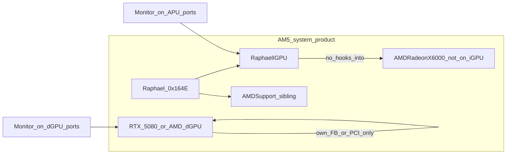

# CURSOR-START-AMD-RDNA2-IGPU — NootedRed-gap RDNA2 APU backend

**Audience:** Cursor coding agents filling `ihv/amd-rdna2-igpu/`.  
**Product:** display scanout + Metal on AMD **RDNA2 iGPUs** that NootedRed does not support — first board **Ryzen 7000 Raphael** (7950X3D / 7950X / siblings).  
**This file:** living plan for this slot. Shares host contracts with [CURSOR-START-AMD.md](CURSOR-START-AMD.md). Do not rewrite `host/` except vendor-agnostic shells (`iofb/`, later `ioaccel/`).  
**Updated:** 8 Sep 2026 (BUILD-RULES: macOS 26 + WEG absent; Apple Silicon track opened). Prior: 7 Sep 2026 (OpenCore inject log + SysReport VFCT). First draft 3 Sep 2026.

**Binding project rules:** [BUILD-RULES.md](BUILD-RULES.md) — **macOS 26** ship pin, **WhateverGreen absent**, Apple Silicon display track is in-scope elsewhere.

**Hard rules.** No SIP / OpenCore / AuxKC / unsigned-kext recipes. No Lilu / NootedRed / WhateverGreen *patch recipes*. Product stack runs **without** WhateverGreen (§2.1). **No X6000 personality spoof or Info.plist injection onto Raphael DID `0x164E`** — match-level fake-id is not a substitute for this IHV (§0.2). If a selector, entitlement, bundle ID, IOGPU method, PM4 opcode, or firmware RPC is not in the research corpus, a public header you have opened, or a URL cited here, write **UNKNOWN** and stop that branch.

---

## 0. Current state (7 Sep 2026)

Bring-up evidence was captured on **Sequoia 15.7.8 (24G824)** on the lab 7950X3D. **Ship / acceptance OS is macOS 26** with **WhateverGreen absent** ([BUILD-RULES.md](BUILD-RULES.md)). Re-validate attach/FB/Metal on 26 before claiming a phase green.

| Phase | Plan intent | Status |
|---|---|---|
| **R0** board freeze + oracle | Identity, WEG+dGPU baseline, firmware names | **Mostly done.** Sequoia dump locked DID/ACPI/nubs. 7 Sep SysReport: GOP 3840×2160, VFCT ATOM = HDMI-A+DP. **X6000 ABI oracle still missing** (lab dGPU is RTX 5080, no AMD Metal). Firmware redistrib license UNKNOWN. Physical HDMI vs DP jack UNKNOWN. |
| **R1** enumerate + firmware | Personality, BARs, PSP/SMU heartbeat | **Partial.** `RaphaelController` maps BAR0/1, parses ATOM or falls back HDMI+DP+USB-C. **First OC inject (v0.1.0) failed:** `IOGraphicsFamily` not in Boot KC — kext never loaded. Controller kext now omits that family. VFCT parser is portable; kext still only maps PCI ROM (ACPI VFCT copy in-kernel = UNKNOWN). **No PSP/GC/DCN firmware load** (license stop). `make test` includes VFCT wrap. Darwin `make kext` not run in this environment. |
| **R2** dumb framebuffer | WindowServer on APU HDMI/DP | **In tree as `RaphaelFB.kext`, not in kernel.** GOP/linear wrap via `IOFBLinearShell` + `RaphaelFramebuffer`. Probe **100000** vs IONDRV **20000**. Same Boot KC dependency as the failed inject. Extra HDMI/DP nubs **offline** (one GOP scanout). Dual independent heads = later DCN. |
| **R3** non-Metal compute | UMA BO + GFX10.3 PM4 | **Not started.** |
| **R4** AIR → gfx1036 | Offline compiler | **Not started.** |
| **R5** MTLDriver.bundle | `MTLCopyAllDevices` | **Stub plist only.** `raphael_metal=1` advertises the name; **leave off**. Not QE/Metal. |
| **R6** present | `CAMetalLayer` on our heads | **Not started** (needs R2 green + R5). |
| **R7** Rembrandt | `gfx1035` | **Deferred.** |

**Honest Sequoia outcome of the current kexts:** `RaphaelIGPU.kext` is the Boot KC piece — if it injects, IOKit can attach `RaphaelController` on `IGPU@0` beside `AMDSupport` while **`IONDRVFramebuffer` keeps the picture**. That is still **not** video acceleration. GOP wrap is `dev.metalgpudrivers.RaphaelFB` and needs `IOGraphicsFamily` in the same kernel collection (the 7 Sep log failed that prelink). Metal/QE still needs DCN 3.1.5 modeset + IOGPU user clients + AIR→`gfx1036`.

Kext bundles: **`dev.metalgpudrivers.RaphaelIGPU`** + **`dev.metalgpudrivers.RaphaelFB`**. Build/load notes: [`ihv/amd-rdna2-igpu/docs/BUILD.md`](../ihv/amd-rdna2-igpu/docs/BUILD.md). Slot README: [`ihv/amd-rdna2-igpu/README.md`](../ihv/amd-rdna2-igpu/README.md).

### 0.1 What exists in the tree

| Path | Role |
|---|---|
| `host/iofb/IOFBLinearShell.*` | Vendor-agnostic linear `IOFramebuffer` (32-bit XRGB, software cursor, timer VBL) |
| `ihv/amd-rdna2-igpu/kext/` | `Info.plist` + kmod (`RaphaelIGPU`); `RaphaelFB-Info.plist` + kmod (`RaphaelFB`) |
| `match/RaphaelController.*` | DID-only `0x164E1002`, category **`RaphaelHW`** (sibling to Apple `AMDSupport`) |
| `display/atom_parse.*` | ATOM `displayObjectInfo` v1.4/v1.5 + ACPI VFCT VBIOS extract; HDMI-A/B `0x0C`/`0x0D`, DP `0x13`, USB-C `0x17`, eDP `0x14` ([ObjectID.h](https://github.com/torvalds/linux/blob/master/drivers/gpu/drm/amd/amdgpu/ObjectID.h), [atomfirmware.h](https://github.com/torvalds/linux/blob/master/drivers/gpu/drm/amd/include/atomfirmware.h)). Lab VFCT: HDMI-A+DP only |
| `display/RaphaelFramebuffer.*` | GOP wrap; default mode **3840×2160** from lab IOFBMemorySize; optional `raphael_width`/`raphael_height` |
| `display/RaphaelConnectorNub.*` | Extra heads as child nubs (not a second PCI `IOFramebuffer`) |
| `submit/RaphaelAccelerator.*` | Plain `IOService` — **not** `IOAccelDevice` (no IOGPU selectors invented) |
| `metal/RaphaelMTLDriver/` | Bundle plist stub only |
| `firmware/README.md` | linux-firmware name list; blobs not committed |
| `ihv/nvidia/docs/` | RTX 5080 lab inventory (Blackwell); Nvidia Phase 1 remains Ampere |

### 0.2 Decisions locked after R0 (changes from the 3 Sep draft)

| Decision | Was (draft) | Now |
|---|---|---|
| Fill order | Prefer RDNA3 dGPU P0–P2 before this slot | **This slot started first** — lab board is Raphael + 5080, not an RX 7000 |
| Bring-up OS | Tahoe only | Sequoia 15.7.8 dumps are history; **macOS 26** is ship/acceptance (WEG absent) |
| dGPU oracle | Prefer AMD RX 6000 + WEG for X6000 traces | Lab companion is **RTX 5080** (`10de:2c02`). Isolation tests only. X6000 oracle still needed on another box or later AMD card. **No WEG in product config** |
| Apple RDNA2 kext | Trace X6000; do not spoof | **Reconfirmed.** User asked to patch/spoof Raphael as Navi 2 so `AMDRadeonX6000` attaches. **Rejected:** DID fake ≠ DCN 3.1.5 / UMA / 2 CU / PSP 13.0.5. `AMDSupport` already matching the iGPU is **not** Metal. Do not inject `0x164E` into Apple AMD personalities |
| `AMDSupport` | Open (fight vs coexist) | **Coexist.** Controller category `RaphaelHW`. We claim **`IOFramebuffer` only** (probe 100000 vs NDRV 20000 vs AMDSupport 65050 on a different category) |
| First FB | DCN modeset on APU connectors | **GOP wrap first.** Firmware already owns a 4K head via IONDRV. DCN 3.1.5 modeset is the next display slice (HDMI/DP independent pipes, USB-C later) |
| Extra connectors | Unspecified | ATOM enum; extras **offline** unless `raphael_force_all=1` (still one GOP buffer — not dual scanout) |
| USB-C DP-Alt | In scope | **Enumerated, offline, lower priority** than HDMI/DP |
| Metal plugin | Phase R5 | Stub exists; **`raphael_metal` default off** so Metal.framework does not `dlopen` a fake plugin |
| Accelerator class | IOGPU-speaking kext | Stub `IOService` until selectors are traced from X6000 |
| Match hygiene | DID-only | Locked: **`IOPCIPrimaryMatch=0x164E1002`**. Never class-match `0x03000000`, never `IONameMatch=display` (5080 is also `display`) |
| Boot KC vs System KC | Unspecified | **Split kexts.** `RaphaelIGPU` must not list `IOGraphicsFamily` (7 Sep inject: `Invalid Parameter`). GOP wrap stays in `RaphaelFB`. This repo still does not document how to put `IOGraphicsFamily` in the Boot KC |

Boot-args in the current kext: `raphael_width` / `raphael_height` (GOP mode), `raphael_force_all`, `raphael_metal` (do not use).

---

## 1. Goal

Build an **unofficial IHV-quality GPU stack** so the **Raphael RDNA2 iGPU** (and later Rembrandt) can do **display + Metal** on a Hackintosh-on-AMD-APU machine where kexts can be loaded for development — on **macOS 26 without WhateverGreen**, with optional discrete GPUs that own their own connectors.

**Done** = WindowServer desktop on whichever GPU has the active monitor cable(s); `MTLCopyAllDevices()` can return **both** our iGPU and a discrete Metal device when that dGPU has Metal; product config has **no WhateverGreen**. Spoofing Raphael as Navi 21 so `AMDRadeonX6000` attaches, extending NootedRed with Lilu patches, requiring `-wegnoegpu`, or **depending on WEG** are **not-done**.

**Stance:** Hard, but closer than RDNA3 dGPU in one respect: Apple’s live discrete Metal stack **is** RDNA2 (`AMDRadeonX6000`). Use it as an **ABI oracle** (IOGPU selectors, `MetalPluginName`). The new work is **APU form factor** (UMA, DCN 3.1.5, 2 CU, APU match) plus **multi-GPU hygiene**. APU DCN/UMA ≠ Navi 21 FB. Same GFX generation is not a loadable personality for `0x164E`.

---

## 2. Why this section (NootedRed gap)

NootedRed is the existing community kext for AMD **iGPU** acceleration on Hackintosh. Its published compatibility is the **Vega Raven / GCN 5** APU family (Ryzen 1xxx–5xxx and the **7x30** parts that reused GCN 5) ([ChefKiss NootedRed](https://chefkiss.dev/applehax/nootedred/)).

Maintainer statement on Raphael / 7950X ([NootedRed discussion #345](https://github.com/ChefKissInc/NootedRed/discussions/345)):

> The only Ryzen 7000 series that is supported by NootedRed is the 7030 series, as they reused the GCN 5 APUs on that one. The others are RDNA 2. RDNA 2 is not supported by NootedRed yet.

| AMD part | Arch | NootedRed | This IHV |
|---|---|---|---|
| Ryzen 1xxx–5xxx APUs, **7x30** | GCN 5 / Vega | In scope for NootedRed | **Out** — do not duplicate |
| **Raphael** Ryzen 7000 AM5 iGPU (7950X3D, …) | **RDNA2** `gfx1036` | **Unsupported** | **First target — kext started** |
| Rembrandt Ryzen 6000 mobile | RDNA2 `gfx1035` | Unsupported | Later sibling |
| Phoenix / Hawk Point 700M | RDNA3 `gfx1103` | Unsupported | Not this folder |
| Strix Point 800M | RDNA 3.5 `gfx115x` | Unsupported | `ihv/amd-rdna35-igpu/` |

**“Similar in style to NootedRed”** means: purpose-built AMD **iGPU** enablement on AMD platforms, FB then Metal, honest identity. It does **not** mean forking NootedRed, patching Apple AMD kexts, or adding `0x164E` to `AMDRadeonX6000` Info.plist. Product shape: FB kext + accelerator kext + `*MTLDriver.bundle`.

### 2.1 WhateverGreen absent + discrete GPU coexistence (hard product requirement)

**Project policy:** [BUILD-RULES.md](BUILD-RULES.md) — product OS is **macOS 26**, **WhateverGreen absent**.

NootedRed’s published install rules center on removing WEG and disabling discrete GPUs ([NootedRed docs](https://chefkiss.dev/applehax/nootedred/)). This IHV is a **new backend** that neither depends on WEG nor requires killing the dGPU.

| Constraint | NootedRed | This IHV (product) |
|---|---|---|
| WhateverGreen | Remove WEG | **Absent** — not installed; no WEG patch dependency |
| Discrete GPU present | Often disable dGPU | **Allowed** — dGPU keeps its own FB/Metal path; we never match its DID |
| Match scope | Mixes X5000/X6000 paths for iGPU | **Raphael DID only** (`0x164E`; Rembrandt later) — never claim other AMD DIDs |
| Global AMD hooks | Lilu patches into Apple AMD stack | **None** — no Lilu, no WEG, no Apple AMD binary patches |
| Primary display | iGPU-centric (dGPU off) | **Connector-driven** — see below |

**Primary display policy (locked): connector-driven.** Whichever GPU has the active monitor cable(s) owns that display / WindowServer head. No forced “iGPU primary” or “dGPU primary.” If the cable is on the discrete card, that card’s FB (Apple X6000 or another IHV) is primary; if the cable is on the motherboard/APU outputs, our Raphael FB is primary; both may be active when monitors are on both.

**Architectural rules:**

1. **Narrow `match/`** — attach only to Raphael (and later Rembrandt) identity. Never `IOPCIPrimaryMatch` wildcards that catch Navi/RX dGPUs. **Implemented:** `0x164E1002` only.  
2. **No shared Apple AMD personality** — do not inject into `AMDRadeonX6000*` / `AMDRadeonX5000*` Info.plist paths used by the discrete card.  
3. **No Lilu / WEG plugin** — product kexts are standalone IOKit drivers behind `host/`.  
4. **Independent registry trees** — our accelerator / FB / `MetalPluginName` live only under the iGPU nub. Discrete card’s properties remain untouched.  
5. **Multi-device Metal** — after R5, `MTLCopyAllDevices()` may list both GPUs. Apps pick a device; we do not steal `CGDirectDisplayCopyCurrentMetalDevice` from a display we do not drive.  
6. **Do not require** `-wegnoegpu`, `-wegnoigpu`, or WhateverGreen. Sequoia traces that showed WEG loaded are **historical only**.

**Reference dual-GPU board:** **7950X3D + RTX 5080** — [`boards.md`](../ihv/amd-rdna2-igpu/docs/boards.md), Nvidia inventory [`ihv/nvidia/docs/boards.md`](../ihv/nvidia/docs/boards.md). Unsupported companions must **not** break iGPU attach. Dual-`MTLDevice` acceptance still needs an AMD dGPU with Metal later. Acceptance runs on **macOS 26 without WEG**.

### 2.2 Lab evidence (Sequoia dump)

**Sequoia 15.7.8 (24G824)** in [`ihv/amd-rdna2-igpu/docs/traces/sequoia-7950x3d/`](../ihv/amd-rdna2-igpu/docs/traces/sequoia-7950x3d/):

| Field | Measured |
|---|---|
| CPU | Ryzen 9 **7950X3D**, SMBIOS MacPro7,1 |
| iGPU | `1002:164E` rev **C9**, BDF `12:0:0`, nub **`IGPU@0`**, ACPI **`_SB.PCI0.GP17.VGA`**, subsys `1043:8877` (ASUS family — exact board SKU still UNKNOWN) |
| FB before our kext | `IONDRVFramebuffer` (`.display_boot`), main display 3840×2160, IOFBMemorySize ≈ 33 177 600 |
| Also on iGPU | Apple **`AMDSupport`** (probe 65050, `IOPCIMatch` any `1002` VGA) — **not** `AMDRadeonX6000` / not Metal |
| Loaded GPU-ish kexts (historical Sequoia) | Lilu 1.7.2, WhateverGreen **1.7.1d7** (laobamac), `com.apple.kext.AMDSupport` 7.0.0. **No** `AMDRadeonX6000*`. **Product config: WEG absent on macOS 26.** |
| dGPU | RTX 5080 `10de:2c02` rev A1, nub `GFX0@0`, MSI `1462:5315` |

Earlier Monterey report: same dual listing, unaccelerated iGPU boot.

| What it proves | What it does not prove |
|---|---|
| Exact match identity for our personality | On-box attach of `RaphaelIGPU.kext` (7 Sep 2026 inject **failed** before probe; controller-only rebuild not yet captured) |
| Unaccelerated 4K desktop on APU GOP/NDRV; firmware GOP 3840×2160 4 BPP | DCN 3.1.5 programmed by our `IOFramebuffer` |
| Nvidia dGPU PCI coexistence (WEG was loaded in Sequoia dump; product drops WEG) | Dual `MTLCopyAllDevices` (5080 has no Metal) |
| X6000 did **not** bind to `0x164E` (only AMDSupport) | Spoofing it would modeset DCN 3.1.5 — it would not |
| VFCT ATOM HDMI-A + DP on this VBIOS | Which physical jack is the 4K cable |



WhateverGreen is **not** in the product diagram ([BUILD-RULES.md](BUILD-RULES.md) §2).
---

## 3. Host vs create

Same split as [CURSOR-START-AMD.md](CURSOR-START-AMD.md) §2. Apple owns Metal, WindowServer, AIR front-end, IOGPU *framework*. We own APU match, firmware bring-up, framebuffer kext, accelerator kext, Metal plugin, AIR → `gfx1036`, present glue, power helper.

| Layer | HOST | This IHV creates | In tree now |
|---|---|---|---|
| App GPU API | `Metal.framework` | Nothing | — |
| Compositor | WindowServer | `IOFramebuffer` on **APU** outputs | GOP wrap (`IOFBLinearShell` / `RaphaelFramebuffer`) |
| Accelerator | `IOAcceleratorFamily2` / `IOGPUFamily` SPI | Vendor kext speaking those user clients | `RaphaelAccelerator` as `IOService` stub only |
| Plugin discovery | `MetalPluginName` | Our `*MTLDriver.bundle` | Plist stub; not registered unless `raphael_metal=1` |
| Shader front-end | AIR | **AIR → gfx1036** (later gfx1035) | Not started |
| First-party AMD | `AMDRadeonX6000*` | **TRACE ABI only. Do not ship, patch, or spoof.** | `AMDSupport` left as sibling |
| NootedRed / Lilu | Community prior art | **Study gap + negative method. Do not fork.** | — |
| WhateverGreen | **Absent** in product ([BUILD-RULES](BUILD-RULES.md)) | **Do not install, patch, or depend on WEG.** | Historical Sequoia dump only |
| Discrete GPU | Own FB / Metal | **Leave alone.** | 5080 `GFX0` must stay unmatched |

Trace live Intel **X6000** (Sequoia or Tahoe) for IOGPU selectors and `MetalPluginClassName`. Do not invent selector numbers. Lab 5080 cannot provide this oracle.

---

## 4. Hardware scope

### 4.1 First board — Raphael / Ryzen 7000 AM5 iGPU

| Field | Value | Source |
|---|---|---|
| Platform | Ryzen 7000 desktop AM5 (named SKU: **7950X3D**) | Lab dump |
| Code name | **Raphael** | [kernel APU table](https://www.kernel.org/doc/Documentation/gpu/amdgpu/apu-asic-info-table.csv) |
| Marketing GPU | Radeon Graphics (typically **2 CU**) | AMD |
| LLVM `-mcpu` | **`gfx1036`** | [LLVM AMDGPUUsage](https://llvm.org/docs/AMDGPUUsage.html) |
| PCI VID/DID | **`1002:164E` rev `0xC9`** (other Raphael SKUs may differ; do not require C9 in `Info.plist`) | Sequoia ioreg |
| Nub / ACPI | `IGPU@0`, `_SB.PCI0.GP17.VGA`, BDF `12:0:0` | Sequoia ioreg |
| Subsystem | ASUS `1043:8877` (board SKU UNKNOWN) | Sequoia dump |
| DCN | **3.1.5** | kernel APU table |
| GC | **10.3.6** | kernel APU table |
| VCN | 3.1.2 | kernel APU table |
| SDMA | 5.2.6 | kernel APU table |
| MP0 / MP1 (PSP/SMU class) | **13.0.5** | kernel APU table |
| Memory | **UMA** (no discrete VRAM BAR) | APU |

Host: **AMD Hackintosh x86** with Raphael CPU and iGPU enabled in firmware (GOP → APU heads), **macOS 26**, **WhateverGreen absent**. Discrete GPU may be installed. Intel Mac Pro is the wrong host for this slot (no Raphael package). Apple Silicon display acceleration is a **separate** track: [`CURSOR-START-APPLE-SILICON.md`](CURSOR-START-APPLE-SILICON.md) / `ihv/apple-silicon/` — do not conflate AGX/DCP with this AM5 iGPU slot.

### 4.2 Later sibling — Rembrandt

Ryzen 6000 mobile RDNA2 (`gfx1035`). Same backend directories; freeze a separate DID/board before coding. Do not mix Raphael and Rembrandt firmware tables without an explicit SKU file.

### 4.3 Explicitly out of this folder

- Vega / GCN 5 / NootedRed-supported APUs  
- Discrete Navi 21/22/23 (Apple X6000 path or unsupported dGPU — not an iGPU slot)  
- RDNA3 APU (Phoenix / Hawk Point) and RDNA 3.5 (Strix) — other `ihv/` trees  
- Spoofing `0x164E` → Navi DID so Apple X6000 attaches  
- Nvidia / RTX 5080 acceleration (inventory only under `ihv/nvidia/`)

---

## 5. Study sources (read, do not port)

| Source | Use for | Do not |
|---|---|---|
| **Live `AMDRadeonX6000` on Tahoe/Sequoia** | IOGPU shape, `MetalPluginName`, FB user client — **same GFX generation as Raphael** | Patch, spoof DID `0x164E` → Navi, ship Apple blobs |
| **NootedRed + discussion #345** | Gap definition; what GCN5 enablement looked like | Fork Lilu plugins into `ihv/` |
| **GPUOpen / RDNA2 ISA** | AIR → gfx10.3 lowering | Treat ISA PDF as Metal SDK |
| **LLVM AMDGPU** | `gfx1036` / `gfx1035` triples | Claim LLVM talks IOGPU |
| **`amdgpu` KMD + APU table** | PSP 13.0.5, DCN 3.1.5, GC 10.3.6 bring-up notes | Load `amdgpu.ko` on XNU |
| **RADV / ACO** | PM4 / CS shape for GFX10.3 | Port DRM winsys into Metal.framework |
| **Lab Sequoia dump** | Match, AMDSupport sibling, GOP 4K size | Treat NDRV as QE |

---

## 6. Problem areas

| Area | Why hard | Attack / status |
|---|---|---|
| **APU match ≠ dGPU** | Must not catch 5080 or Navi | **R0/R1 design done.** DID-only `0x164E1002`. Confirm on box after load |
| **UMA / 2 CU** | No VRAM BAR; honest `Shared`; tiny vs Navi 21 | Still R3/R5. `uma/` not started |
| **DCN 3.1.5 vs X6000 FB** | X6000 discrete FB ≠ APU display IP | **R2 GOP wrap in tree.** Next: HPD + modeset on HDMI/DP. USB-C later |
| **PSP / SMU 13.0.5** | Signed firmware; macOS redistrib **UNKNOWN** | R1.4 **blocked** — no unsigned flash, no blobs in git |
| **Compiler** | Need **our** AIR→`gfx1036` | R4/R5. X6000 plugin is discrete RDNA2, not gfx1036 UMA |
| **Temptation to spoof X6000** | Same generation → fake-id feels close | **Locked no.** See §0.2. Trace ABI; implement IHV |
| **WEG + dual GPU races** | Broad AMD hooks break dGPU | Narrow match; no Lilu. On-box checklist still open |
| **Primary / AGDP fights** | Two FBs can steal boot display | Connector-driven; no global iGPU-only flags. Measure after GOP wrap loads |

---

## 7. Phased plan + tests (Raphael first)

Do not skip phases. R0 ran without waiting on RDNA3. Hardware accept of R1/R2 still requires loading the kext on the lab board.

### Phase R0 — lock board + oracle — **MOSTLY DONE**

Freeze: AMD AM5 host with **7950X3D**, iGPU enabled, project bundle IDs (not `com.apple.*`). Dual-GPU baseline captured with WEG + RTX 5080.

1. Raphael PCI/ACPI identity — **done** (`1002:164E` rev C9, `IGPU@0`, `_SB.PCI0.GP17.VGA`).  
2. Working **X6000** IORegistry + `MTLCopyAllDevices` on the same OS major — **still open**.  
3. Firmware name list — **listed** in `firmware/README.md`; license **UNKNOWN**.  
4. NootedRed out of product code; WEG + dGPU coexistence in scope — **done**.  
5. Dual-GPU baseline before our kext — **done** (Sequoia traces).

**Accept:** `docs/boards.md` + `unknowns.md` + `coexistence.md`. Remaining R0: board SKU, which APU jack, X6000 oracle, firmware license.

### Phase R1 — enumerate + firmware alive — **PARTIAL (code in tree)**

Personality attaches to Raphael nub; MMIO/BARs mapped; PSP/SMU ready; one doorbell/RPC no-op.

**Accept:**

| ID | Criterion | Status |
|---|---|---|
| R1.1 | Nub trained (`IGPU@0`) | Identity known; attach **unverified on box** |
| R1.2 | Our `IOClass` (`RaphaelController`) | In `Info.plist` |
| R1.3 | VID/DID `1002:164E` readable | `claimRaphael()` |
| R1.4 | Firmware ready **or** UNKNOWN+license block | **License block** — no 3D bit-bang |
| R1.5 | No-op doorbell/RPC | **Not started** (blocked on R1.4) |
| R1.6 | Invisible to Metal | True (no `MetalPluginName` by default) |
| R1.7 | WEG + dGPU: do not claim `GFX0` | Match is DID-only; **measure after load** |

### Phase R2 — dumb framebuffer — **IN TREE, NOT ON-BOX**

`IOFramebuffer` subclass; WindowServer desktop. No Metal. Connector-driven primary (§2.1).

Current implementation wraps GOP (one scanout). **Next R2 work is DCN 3.1.5** so HDMI and DP can be real heads, not just ATOM labels.

**Accept:**

| ID | Criterion | Status |
|---|---|---|
| R2.1 | FB + console/panic | Code: `isConsoleDevice` on GOP head; **unverified** |
| R2.2 | Login/desktop when monitor on **APU** outputs | Relies on GOP; **unverified** |
| R2.3 | Cursor/VBL stubbed | Timer VBL + software cursor in `IOFBLinearShell` |
| R2.4 | Unaccelerated OK | Intended |
| R2.5 | Monitor only on **dGPU**: do not steal primary | Design intent; **unverified** |
| R2.6 | WEG stays; no `-wegnoegpu` | Design intent |
| R2.HDMI/DP | Independent modeset on both jacks | **Not done** — DCN |
| R2.USBC | DP-Alt | Enumerated offline; lower priority |

### Phase R3 — non-Metal compute — **NOT STARTED**

UMA BO alloc; GFX10.3 PM4 compute packet; known pattern in mapped buffer. Blocked on R1.4 firmware unless a documented no-firmware poke exists (do not invent).

### Phase R4 — AIR → gfx1036 (no MTLDevice) — **NOT STARTED**

### Phase R5 — MTLDriver.bundle — **STUB ONLY**

Do not set `MetalPluginName` until the plugin compiles a trivial kernel. `raphael_metal=1` is a foot-gun.

### Phase R6 — present — **NOT STARTED**

### Phase R7 — Rembrandt (optional) — **DEFERRED**

---

## 8. Repo layout

```
host/
  iofb/           IOFBLinearShell (exists)
  ioaccel/        README only — no IOAccelDevice until X6000 selectors traced
  mtl-plugin/     Notes; Raphael stub lives in the IHV tree
ihv/amd-rdna2-igpu/
  kext/           RaphaelIGPU + RaphaelFB Info.plist / kmod
  match/          RaphaelController — 0x164E ONLY
  display/        ATOM/VFCT parse, GOP FB, connector nubs; DCN 3.1.5 next
  submit/         RaphaelAccelerator stub; PM4 later
  metal/          RaphaelMTLDriver plist stub
  firmware/       Names only; no blobs
  include/        RaphaelIds.h
  docs/           boards, coexistence, unknowns, BUILD, traces
  Makefile        `make test` portable; `make kext` Darwin
```

`host/` stays vendor-agnostic. Do not edit `ihv/amd-rdna3/` ISA for this slot. WhateverGreen is **not** part of the product stack.

---

## 9. Do-nots

1. **Do not spoof Raphael `0x164E` (or Rembrandt) onto an Apple X6000 / Navi DID.**  
2. **Do not inject `0x164E` into Apple `AMDRadeonX6000*` / `AMDRadeonX6000Framebuffer` personalities**, and do not write Lilu patches that do the same.  
3. **Do not fork NootedRed or Lilu into product code.** Cite as gap/prior art only.  
4. **Do not install or depend on WhateverGreen** for this IHV (product = WEG absent).  
5. **Do not patch WhateverGreen or Apple AMD dGPU kexts** to “make room” for the iGPU.  
6. **Do not match or claim discrete GPU DIDs** (including `10de:2c02`).  
7. **Do not force iGPU- or dGPU-primary** — connector-driven only.  
8. **Do not claim NootedRed “will support RDNA2 soon” as a substitute for this IHV.**  
9. **Do not put Vega / 7x30 / Phoenix / Strix into this folder.**  
10. **Do not write SIP, OpenCore, AuxKC, or unsigned-kext load steps.** If attach fails: IORegistry dump and stop.  
11. **Do not flash unsigned PSP/SMU/GC firmware.** License UNKNOWN → stop.  
12. **Do not invent IOGPU selectors or AIR opcodes.** UNKNOWN + cite.  
13. **Do not treat Intel Mac Pro PCIe as the Raphael bring-up host.**  
14. **Do not enable `raphael_metal=1` until R5 is real.**  
15. **Never say impossible.** Say what is hard, why, and which phase attacks it. Apple Silicon display work belongs in `ihv/apple-silicon/`, not “blocked forever.”

---

## 10. Open questions

Resolve from public headers, traces, and the lab machine. Do not guess.

| # | Question | Status |
|---|---|---|
| 1 | Exact IOKit nub / ACPI path | **RESOLVED** — `IGPU@0`, `_SB.PCI0.GP17.VGA`, `12:0:0`, rev C9 |
| 2 | Sequoia/Tahoe X6000 IOGPU user-client identity | OPEN — need AMD dGPU oracle |
| 3 | macOS redistrib license for Raphael firmware | OPEN |
| 4 | `CompilerPluginInterface` vs in-bundle AIR→gfx1036 | OPEN |
| 5 | Honest minimum `MTLGPUFamily` for 2 CU UMA | OPEN |
| 6 | X6000 DCN UC vs DCN 3.1.5 | OPEN — GOP wrap does not answer this |
| 7 | Rembrandt DID vs shared match | OPEN — deferred R7 |
| 8 | Primary display policy | **RESOLVED** — connector-driven. Remaining: GOP handoff when both GPUs cabled |
| 9 | Does any leftover WEG build patch `0x164E`? | N/A for product (WEG absent); measure only if a lab still has WEG |
| 10 | Nvidia companion isolation | **Code DID-only; confirm on box** that `GFX0` is untouched |
| 11 | `AMDSupport` sibling | **RESOLVED (design)** — `RaphaelHW` + IOFramebuffer takeover. Confirm on box |
| 12 | Which physical APU jack is the 4K desktop | OPEN — ask board owner (HDMI vs DP vs USB-C) |
| 13 | Sequoia dumps vs Tahoe ship pin | **LOCKED** — develop may use older dumps; **accept on macOS 26, WEG absent** |
| 14 | Patch Raphael into Apple X6000 as Navi 2 | **REJECTED** — §0.2 |
| 15 | Boot KC inject of IOFramebuffer kext | **RESOLVED (cause)** — `IOGraphicsFamily` not in Boot KC (7 Sep log). Split kexts. No OC recipe. |
| 16 | Lab VFCT connectors | **PARTIAL** — HDMI-A + DP. USB-C not in that VBIOS. Physical jack OPEN. |

---

## 11. Next execution order

1. **Rebuild and load `RaphaelIGPU.kext`** (controller only) on the lab host using the existing kext load path; prefer **macOS 26 without WEG**. Capture `kextstat` + `ioreg` of `IGPU@0`. Expect **NDRV still winning**. Confirm `RaphaelController` attached and `GFX0` unchanged.  
2. Record **motherboard SKU** and **which APU jack** is 4K (VFCT has both HDMI-A and DP). GOP mode is already 3840×2160 on Sequoia — re-measure on 26.  
3. `RaphaelFB.kext` remains blocked until `IOGraphicsFamily` is in the same kernel collection as that kext — diagnose only; do not write a load recipe here.  
4. **R2 DCN 3.1.5** — HPD + modeset for HDMI and DP (USB-C after). Do not mark extra nubs online until pipes are real.  
5. **X6000 oracle** on macOS 26 (RX 6000-class, not the 5080). File IOGPU selectors before any `IOAccelDevice` subclass.  
6. **R1.4** — firmware license; stop if UNKNOWN.  
7. **R3–R6** after R2 on-box green. Keep discrete-GPU isolation; **no WEG**.  
8. Keep NootedRed external; never a submodule.

---

## 12. Sources

**Gap / prior art:** [NootedRed](https://chefkiss.dev/applehax/nootedred/) (WEG/dGPU install model — not ours); [discussion #345 — 7950X / RDNA2 unsupported](https://github.com/ChefKissInc/NootedRed/discussions/345); [amd-osx thread](https://forum.amd-osx.com/threads/nootedred-kext-and-7950x.5780/).

**Hardware:** [kernel APU ASIC table](https://www.kernel.org/doc/Documentation/gpu/amdgpu/apu-asic-info-table.csv); [AMD hardware list](https://docs.kernel.org/gpu/amdgpu/amd-hardware-list-info.html); [Coelacanth DID map (Raphael `0x164E`)](https://www.coelacanth-dream.com/posts/2019/12/30/did-rid-product-matome-p2/); [LLVM AMDGPUUsage](https://llvm.org/docs/AMDGPUUsage.html).

**ATOM:** linux `atomfirmware.h` (`atom_rom_header_v2_2`, `display_object_info_table_v1_4` / `v1_5`); `ObjectID.h` connector IDs.

**Shared AMD IHV rules:** [CURSOR-START-AMD.md](CURSOR-START-AMD.md); [BUILD-RULES.md](BUILD-RULES.md); Apple eGPU / discrete Metal policy [102363](https://support.apple.com/en-us/102363); [IOFramebuffer.h](https://github.com/apple-oss-distributions/IOGraphics/blob/main/IOGraphicsFamily/IOKit/graphics/IOFramebuffer.h).

**WEG:** [WhateverGreen](https://github.com/acidanthera/WhateverGreen) — **absent** from product; Sequoia dumps may still mention it historically.

**Negative methodology:** DID spoof / X6000 personality injection; WhateverRed / NootedRed global Apple-AMD mixing.

---

*Living plan. Code lives under `ihv/amd-rdna2-igpu/` and `host/iofb/`. If a claim is not cited, treat it as UNKNOWN and look it up before coding.*
