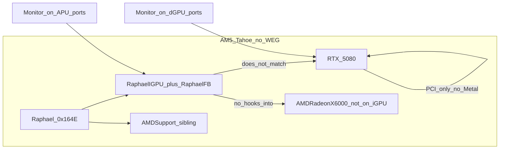

# CURSOR-START-AMD-RDNA2-IGPU — NootedRed-gap RDNA2 APU backend

**Audience:** Cursor coding agents filling `ihv/amd-rdna2-igpu/`.  
**Product:** display scanout + Metal on AMD **RDNA2 iGPUs** that NootedRed does not support — first board **Ryzen 7000 Raphael** (7950X3D / 7950X / siblings).  
**This file:** living plan for this slot. Shares host contracts with [CURSOR-START-AMD.md](CURSOR-START-AMD.md). Do not rewrite `host/` except vendor-agnostic shells (`iofb/`, later `ioaccel/`).  
**Updated:** 13 Sep 2026 (0.2.10 recoverability: lab `raphael_dcn_modeset=1` is GPINT + reaffirm + HUBP blank/unblank only. 0.2.9 `V_TOTAL+1` as live DP timing is the black-screen cause; not acceleration. Sleep/shutdown/restart **parked**). First draft 3 Sep 2026.

**Hard rules.** No SIP / OpenCore / AuxKC / unsigned-kext *recipes*. Lab fact (not a recipe): AuxKC came from **`/Library/Extensions`** (not `/tmp`); runtime `kmutil load` is too late vs IONDRV. No Lilu / NootedRed / WhateverGreen *patch recipes*. WEG is **not required** and is **not loaded** on the current Tahoe lab; if it appears on another install, remain compatible (§2.1). **No X6000 personality spoof or Info.plist injection onto Raphael DID `0x164E`** — match-level fake-id is not a substitute for this IHV (§0.2). If a selector, entitlement, bundle ID, IOGPU method, PM4 opcode, or firmware RPC is not in the research corpus, a public header you have opened, or a URL cited here, write **UNKNOWN** and stop that branch.

---

## 0. Current state (13 Sep 2026)

Bring-up OS is **macOS 26 Tahoe** (Darwin 25.6.0, `OS Build Version` **25G83**) on the lab 7950X3D. **WhateverGreen is not loaded.** The Sequoia 15.7.8 (24G824) dump is **historical** (identity + dual-GPU PCI). Tahoe iGPU nub is **`VGA@0`** under `GP17@8,1` (`pci1002,164e`), not Sequoia’s `IGPU@0`. Match is DID-only.

Kexts: **`dev.metalgpudrivers.RaphaelIGPU`** (PCI controller) + **`dev.metalgpudrivers.RaphaelFB`** (GOP `IOFramebuffer`). RaphaelFB lists `com.apple.iokit.IOGraphicsFamily`. Current tree **0.2.10**. 0.2.8 on-box boot 13 Sep 2026: one GPINT, `blank/unblank ok`. **0.2.9 left `V_TOTAL+1` as live DP timing on `raphael_dcn_modeset=1`** — MMIO can read as success while the sink stays black (not Metal). AuxKC from `/Library/Extensions`. Firmware in IGPU Resources. `raphael_map` / `raphael_metal` stay **off**. Lab boot-args: `-v keepsyms=1 debug=0x100 raphael_dcn_modeset=1`. `raphael_dcn_probe=1` / `raphael_dcn_dump=1` are dangerous opt-in BAR5 **read-only** maps (default off). `raphael_dcn_modeset=1` maps BAR5 after GOP wrap, GPINTs GOP-resident DMCUB, reaffirms the live OTG0 4K pipe, then HUBP blank/unblank (**same GOP totals**). `raphael_dcn_vtotal=1` is a separate opt-in OTG probe that **restores GOP totals before unblank**. Default boot without `raphael_dcn_modeset=1` still GOP-wraps with **no** DCN writes. **Sleep / shutdown / restart are parked** — do not join PCI PM or blank HUBP from `setPowerState`. If the console is already black from 0.2.9: drop `raphael_dcn_modeset=1` for GOP wrap only, or `raphael_fb=0` for IONDRV, then install 0.2.10.

| Phase | Plan intent | Status |
|---|---|---|
| **R0** board freeze + oracle | Identity, dGPU baseline, firmware names | **PCI + Tahoe recapture done.** Sequoia dump locked DID/ACPI. Tahoe 25G83 locked nub `VGA@0` + R1/R2 ioreg. **X6000 ABI oracle still missing** (lab dGPU is RTX 5080). `LICENSE.amdgpu` covers DMCUB/PSP blobs. Physical jack **DP** (user). |
| **R1** enumerate + firmware | Personality, BARs, PSP/SMU heartbeat | **On-box (0.2.2).** `RaphaelController` on `VGA@0` `1002:164e`, `RaphaelMap=No`. **0.2.4:** default connectors=2 (HDMI then DP from VFCT; no USB-C). AMDSupport sibling. 0.2.6+ fetches DMCUB + PSP toc/ta at build. Default path does not map BAR0. |
| **R2** dumb framebuffer | WindowServer on APU HDMI/DP | **On-box wrap colors honest (0.2.3).** WindowServer on `RaphaelFramebuffer`. **0.2.7:** boot head **DP** index 1; GPINT + OTG0 4K **reaffirm**. **0.2.8 on-box:** HUBP blank/unblank (picture came back). **0.2.9:** `V_TOTAL+1` as live DP timing — **black screen, MMIO-success is not a picture**. **0.2.10:** lab `raphael_dcn_modeset=1` back to 0.2.8 pipe; V_TOTAL probe opt-in + restore-before-unblank. Dual independent heads = later — **not next**. Sleep/shutdown/restart **parked**. |
| **R3** non-Metal compute | UMA BO + GFX10.3 PM4 | **Not started.** |
| **R4** AIR → gfx1036 | Offline compiler | **Not started.** |
| **R5** MTLDriver.bundle | `MTLCopyAllDevices` | **Stub plist only.** `raphael_metal=1` **leave off**. |
| **R6** present | `CAMetalLayer` on our heads | **Not started** (needs honest R2 + R5). |
| **R7** Rembrandt | `gfx1035` | **Deferred.** |

**Honest Tahoe outcome (0.2.8 boot 13 Sep 2026; 0.2.10 restores that pipe):** WindowServer owns our `IOFramebuffer` on the GOP head when the kexts are in AuxKC **before** IONDRV claims `IOFramebuffer`. Load after that match does not replace `.Display_boot`. GOP wrap is honest (`BAR0 phys=0x10000000000` 3840×2160 pitch 15360). That is **not** video acceleration. `raphael_dcn_modeset=1`: BAR5 `phys=0xdd600000 size=524288 map=1`; live pipe OTG0 HPD2 SENSE (physical DP); DMCUB `ENABLE=1 SCRATCH0=0x42 dal_fw=0 mailbox_rdy=1`; `GPINT GET_FW_VERSION ok response=0x05000649` (**once**); OTG0 3840×2160 reaffirm `MASTER_EN=1 H_TOTAL=0xf9f V_TOTAL=0x8ad` (CTL `0x11301` unchanged); HUBP `HUBP_BLANK_EN` blank then unblank (`IOSleep(100)`); `blank/unblank ok`; ioreg `RaphaelDmubOk=Yes`, controller `RaphaelPhase=R2-dcn-modeset`, FB still `R2-gop-wrap` + `connector-kind=DP`; `setDisplayMode hardware 3840x2160 (OTG live DP pipe)`. `OTG_BLANK_CONTROL` is not in `dcn_3_1_5_offset.h`. **0.2.9 diagnosis:** after that path it wrote `V_TOTAL` 0x8ad→0x8ae and unblanked at the new totals. Pass criterion was MMIO (`vtot == old+1`, `MASTER_EN=1`). A DP sink can lose lock when OTG timing changes without DP MSA / DIG / PHY (those registers are **not** programmed here; do not invent them). Restore-on-MMIO-fail does not run if the write sticks. **0.2.10** does not leave `V_TOTAL+1` live on the lab boot-arg. Not PLL/PHY, not dual heads, not Metal. **Sleep / shutdown / restart parked** — 0.2.9 also blanked HUBP from PCI `setPowerState(0)` after start; that is a second one-way black screen. Do not re-join PCI PM until a later slice. **0.2.6** aborted GPINT because `dal_fw=0`; **do not re-introduce that gate.** Metal/QE still needs IOGPU user clients + AIR→`gfx1036`.

Build/load notes: [`ihv/amd-rdna2-igpu/docs/BUILD.md`](../ihv/amd-rdna2-igpu/docs/BUILD.md). Slot README: [`ihv/amd-rdna2-igpu/README.md`](../ihv/amd-rdna2-igpu/README.md).

### 0.1 What exists in the tree

| Path | Role |
|---|---|
| `host/iofb/IOFBLinearShell.*` | Vendor-agnostic linear `IOFramebuffer` (32-bit XRGB, software cursor, timer VBL) |
| `ihv/amd-rdna2-igpu/kext/` | `RaphaelIGPU` + `RaphaelFB` Info.plist + kmod start/stop |
| `match/RaphaelController.*` | DID-only `0x164E1002`, category **`RaphaelHW`** (sibling to Apple `AMDSupport`) |
| `display/atom_parse.*` | ATOM `displayObjectInfo` v1.4/v1.5; HDMI-A/B `0x0C`/`0x0D`, DP `0x13`, USB-C `0x17`, eDP `0x14` ([ObjectID.h](https://github.com/torvalds/linux/blob/master/drivers/gpu/drm/amd/amdgpu/ObjectID.h), [atomfirmware.h](https://github.com/torvalds/linux/blob/master/drivers/gpu/drm/amd/include/atomfirmware.h)) |
| `display/RaphaelDcnRegs.h` | Cited DCN 3.1.5 MMIO from MIT `dcn_3_1_5_offset.h` / `dcn_3_1_5_sh_mask.h` — do not invent missing regs |
| `display/RaphaelDmub.*` | GOP-resident DMCUB GPINT (ENABLE+mailbox_rdy; `dal_fw=0` is not abort) |
| `display/RaphaelDcnModeset.*` | Gated OTG0 4K **reaffirm** + HUBP blank/unblank (`raphael_dcn_modeset=1`); opt-in `V_TOTAL+1` probe (`raphael_dcn_vtotal=1`, restore GOP before unblank) |
| `display/RaphaelFramebuffer.*` | GOP wrap; default mode **3840×2160** from lab IOFBMemorySize; optional `raphael_width`/`raphael_height` |
| `display/RaphaelConnectorNub.*` | Extra heads as child nubs (not a second PCI `IOFramebuffer`) |
| `submit/RaphaelAccelerator.*` | Plain `IOService` — **not** `IOAccelDevice` (no IOGPU selectors invented) |
| `metal/RaphaelMTLDriver/` | Bundle plist stub only |
| `firmware/README.md` | linux-firmware name list; blobs not committed |
| `ihv/nvidia/docs/` | RTX 5080 lab inventory (Blackwell); Nvidia Phase 1 remains Ampere |

### 0.2 Decisions locked after R0 (changes from the 3 Sep draft)

| Decision | Was (draft) | Now |
|---|---|---|
| Fill order | Prefer RDNA3 dGPU P0–P2 before this slot | **This slot started first** — lab board is Raphael + 5080, not an RX 7000 |
| Bring-up OS | Sequoia 15.7.8 then Tahoe ship pin | **macOS 26 Tahoe (25G83), no WEG.** Sequoia dump is historical. Nub on Tahoe is `VGA@0`. |
| dGPU oracle | Prefer AMD RX 6000 + WEG for X6000 traces | Lab companion is **RTX 5080** (`10de:2c02`). Isolation tests only. X6000 oracle still needed on another box or later AMD card |
| Apple RDNA2 kext | Trace X6000; do not spoof | **Reconfirmed.** User asked to patch/spoof Raphael as Navi 2 so `AMDRadeonX6000` attaches. **Rejected:** DID fake ≠ DCN 3.1.5 / UMA / 2 CU / PSP 13.0.5. `AMDSupport` already matching the iGPU is **not** Metal. Do not inject `0x164E` into Apple AMD personalities |
| `AMDSupport` | Open (fight vs coexist) | **Coexist.** Controller category `RaphaelHW`. We claim **`IOFramebuffer` only** (probe 100000 vs NDRV 20000 vs AMDSupport 65050 on a different category) |
| First FB | DCN modeset on APU connectors | **GOP wrap first (on-box).** **0.2.7** GPINT + gated **reaffirm**. **0.2.8** HUBP blank/unblank (on-box, picture came back). **0.2.9** V_TOTAL+1 as live DP timing **bricks the console**. **0.2.10** lab modeset = 0.2.8 pipe. Sleep/shutdown **parked**. Next: cited DP stream/MSA or DIG, **not** a second head, **not** another OTG-only poke on the live jack. |
| Extra connectors | Unspecified | ATOM/VFCT enum; extras **offline** unless `raphael_force_all=1` (still one GOP buffer — not dual scanout). Default **HDMI+DP** (no USB-C). |
| USB-C DP-Alt | In scope | **Enumerated, offline, lower priority** than HDMI/DP |
| Metal plugin | Phase R5 | Stub exists; **`raphael_metal` default off** so Metal.framework does not `dlopen` a fake plugin |
| Accelerator class | IOGPU-speaking kext | Stub `IOService` until selectors are traced from X6000 |
| Match hygiene | DID-only | Locked: **`IOPCIPrimaryMatch=0x164E1002`**. Never class-match `0x03000000`, never `IONameMatch=display` (5080 is also `display`) |

Boot-args in the current kext: `raphael_width` / `raphael_height`, `raphael_swap_rb`, `raphael_force_all`, `raphael_dcn_probe` / `raphael_dcn_dump` (dangerous opt-in BAR5), `raphael_dcn_modeset` (DMUB + OTG reaffirm + HUBP blank/unblank), `raphael_dcn_vtotal` (opt-in OTG probe; needs modeset), `raphael_metal` / `raphael_map` (do not use).

---

## 1. Goal

Build an **unofficial IHV-quality GPU stack** so the **Raphael RDNA2 iGPU** (and later Rembrandt) can do **display + Metal** on a Hackintosh-on-AMD-APU machine where kexts can be loaded for development — **alongside any discrete GPUs** that own their own connectors, **with or without WhateverGreen**.

**Done** = WindowServer desktop on whichever GPU has the active monitor cable(s); `MTLCopyAllDevices()` can return **both** our iGPU and a discrete Metal device. Spoofing Raphael as Navi 21 so `AMDRadeonX6000` attaches, extending NootedRed with Lilu patches, requiring `-wegnoegpu`, requiring WEG to be present, or requiring WEG removal are **not-done**.

**Stance:** Hard, but closer than RDNA3 dGPU in one respect: Apple’s live discrete Metal stack **is** RDNA2 (`AMDRadeonX6000`). Use it as an **ABI oracle** (IOGPU selectors, `MetalPluginName`). The new work is **APU form factor** (UMA, DCN 3.1.5, 2 CU, APU match) plus **multi-GPU hygiene**. APU DCN/UMA ≠ Navi 21 FB. Same GFX generation is not a loadable personality for `0x164E`.

---

## 2. Why this section (NootedRed gap)

NootedRed is the existing community kext for AMD **iGPU** acceleration on Hackintosh. Its published compatibility is the **Vega Raven / GCN 5** APU family (Ryzen 1xxx–5xxx and the **7x30** parts that reused GCN 5) ([ChefKiss NootedRed](https://chefkiss.dev/applehax/nootedred/)).

Maintainer statement on Raphael / 7950X ([NootedRed discussion #345](https://github.com/ChefKissInc/NootedRed/discussions/345)):

> The only Ryzen 7000 series that is supported by NootedRed is the 7030 series, as they reused the GCN 5 APUs on that one. The others are RDNA 2. RDNA 2 is not supported by NootedRed yet.

| AMD part | Arch | NootedRed | This IHV |
|---|---|---|---|
| Ryzen 1xxx–5xxx APUs, **7x30** | GCN 5 / Vega | In scope for NootedRed | **Out** — do not duplicate |
| **Raphael** Ryzen 7000 AM5 iGPU (7950X3D, …) | **RDNA2** `gfx1036` | **Unsupported** | **First target — kext started** |
| Rembrandt Ryzen 6000 mobile | RDNA2 `gfx1035` | Unsupported | Later sibling |
| Phoenix / Hawk Point 700M | RDNA3 `gfx1103` | Unsupported | Not this folder |
| Strix Point 800M | RDNA 3.5 `gfx115x` | Unsupported | `ihv/amd-rdna35-igpu/` |

**“Similar in style to NootedRed”** means: purpose-built AMD **iGPU** enablement on AMD platforms, FB then Metal, honest identity. It does **not** mean forking NootedRed, patching Apple AMD kexts, or adding `0x164E` to `AMDRadeonX6000` Info.plist. Product shape: FB kext + accelerator kext + `*MTLDriver.bundle`.

### 2.1 Discrete GPU coexistence (WEG optional)

NootedRed’s published install rules **reject** this product shape: remove WhateverGreen; do not leave a GCN5/RDNA AMD dGPU enabled (`-wegnoegpu` / `disable-gpu`) ([NootedRed docs](https://chefkiss.dev/applehax/nootedred/)). **This IHV inverts the dGPU constraint.** WEG is **not** part of the Tahoe lab and is **not** a load-time dependency.

| Constraint | NootedRed | This IHV |
|---|---|---|
| WhateverGreen loaded | Conflict — remove WEG | **Optional.** Current Tahoe lab: **no WEG**. Must not require WEG, and must not break if it is loaded elsewhere |
| Discrete GPU present | Conflict — disable dGPU | **Required compatible** — dGPU keeps its own FB/Metal path |
| Match scope | Mixes X5000/X6000 paths for iGPU | **Raphael DID only** (`0x164E`; Rembrandt later) — never claim other AMD DIDs |
| Global AMD hooks | Lilu patches into Apple AMD stack | **None** — no Lilu, no WEG patch sites, no Apple AMD binary patches |
| Primary display | iGPU-centric (dGPU off) | **Connector-driven** — see below |

**Primary display policy (locked): connector-driven.** Whichever GPU has the active monitor cable(s) owns that display / WindowServer head. No forced “iGPU primary” or “dGPU primary.” If the cable is on the discrete card, that card’s FB (Apple X6000, WEG if present, or another IHV) is primary; if the cable is on the motherboard/APU outputs, our Raphael FB is primary; both may be active when monitors are on both.

**Architectural rules that make coexistence work:**

1. **Narrow `match/`** — attach only to Raphael (and later Rembrandt) identity. Never `IOPCIPrimaryMatch` wildcards that catch Navi/RX dGPUs. **Implemented:** `0x164E1002` only.  
2. **No shared Apple AMD personality** — do not inject into `AMDRadeonX6000*` / `AMDRadeonX5000*` Info.plist paths used by the discrete card.  
3. **No Lilu plugin** — product kexts are standalone IOKit drivers behind `host/`. If WEG patches Apple dGPU kexts on another machine, we must not race those patch points.  
4. **Independent registry trees** — our accelerator / FB / `MetalPluginName` live only under the iGPU nub. Discrete card’s `MetalPluginName` and AGDP properties remain untouched.  
5. **Multi-device Metal** — after R5, `MTLCopyAllDevices()` may list both GPUs. Apps pick a device; we do not steal `CGDirectDisplayCopyCurrentMetalDevice` from a display we do not drive.  
6. **Do not require** `-wegnoegpu`, `-wegnoigpu`, `WhateverGreen.kext`, or the absence of WEG.

**Reference dual-GPU board:** **7950X3D + RTX 5080** on **Tahoe without WEG** — [`boards.md`](../ihv/amd-rdna2-igpu/docs/boards.md), Nvidia inventory [`ihv/nvidia/docs/boards.md`](../ihv/nvidia/docs/boards.md). Unsupported companions must **not** break iGPU attach. Dual-`MTLDevice` acceptance still needs an Apple-supported AMD dGPU later.

### 2.2 Lab evidence (historical Sequoia dump)

**Sequoia 15.7.8 (24G824)** in [`ihv/amd-rdna2-igpu/docs/traces/sequoia-7950x3d/`](../ihv/amd-rdna2-igpu/docs/traces/sequoia-7950x3d/) — **not** the current OS. Recapture the same files on Tahoe without WEG.

| Field | Measured |
|---|---|
| CPU | Ryzen 9 **7950X3D**, SMBIOS MacPro7,1 |
| iGPU | `1002:164E` rev **C9**, BDF `12:0:0`, Sequoia nub **`IGPU@0`**, ACPI **`_SB.PCI0.GP17.VGA`**, subsys `1043:8877` (ASUS family — exact board SKU still UNKNOWN). **Tahoe nub is `VGA@0`.** |
| FB before our kext | `IONDRVFramebuffer` (`.display_boot`), main display 3840×2160, IOFBMemorySize ≈ 33 177 600 |
| Also on iGPU | Apple **`AMDSupport`** (probe 65050, `IOPCIMatch` any `1002` VGA) — **not** `AMDRadeonX6000` / not Metal |
| Loaded GPU-ish kexts | Lilu 1.7.2, WhateverGreen **1.7.1d7** (laobamac), `com.apple.kext.AMDSupport` 7.0.0. **No** `AMDRadeonX6000*`. **Not the Tahoe lab.** |
| dGPU | RTX 5080 `10de:2c02` rev A1, nub `GFX0@0`, MSI `1462:5315` |

Earlier Monterey report: same dual listing, unaccelerated iGPU boot.

| What it proves | What it does not prove |
|---|---|
| Exact match identity for our personality | DCN 3.1.5 programmed by our `IOFramebuffer` |
| Unaccelerated 4K desktop on APU GOP/NDRV | Honest GOP physical (Tahoe wrap used a bad `v_baseAddr`) |
| Nvidia dGPU PCI coexistence (WEG was loaded on Sequoia) | Dual `MTLCopyAllDevices` (5080 has no Metal) |
| X6000 did **not** bind to `0x164E` (only AMDSupport) | Spoofing it would modeset DCN 3.1.5 — it would not |



---

## 3. Host vs create

Same split as [CURSOR-START-AMD.md](CURSOR-START-AMD.md) §2. Apple owns Metal, WindowServer, AIR front-end, IOGPU *framework*. We own APU match, firmware bring-up, framebuffer kext, accelerator kext, Metal plugin, AIR → `gfx1036`, present glue, power helper.

| Layer | HOST | This IHV creates | In tree now |
|---|---|---|---|
| App GPU API | `Metal.framework` | Nothing | — |
| Compositor | WindowServer | `IOFramebuffer` on **APU** outputs | GOP wrap (`IOFBLinearShell` / `RaphaelFramebuffer`) |
| Accelerator | `IOAcceleratorFamily2` / `IOGPUFamily` SPI | Vendor kext speaking those user clients | `RaphaelAccelerator` as `IOService` stub only |
| Plugin discovery | `MetalPluginName` | Our `*MTLDriver.bundle` | Plist stub; not registered unless `raphael_metal=1` |
| Shader front-end | AIR | **AIR → gfx1036** (later gfx1035) | Not started |
| First-party AMD | `AMDRadeonX6000*` | **TRACE ABI only. Do not ship, patch, or spoof.** | `AMDSupport` left as sibling |
| NootedRed / Lilu | Community prior art | **Study gap + negative method. Do not fork.** | — |
| WhateverGreen | Optional; **absent on Tahoe lab** | **Do not patch, require, or depend on.** | Compatible by non-overlap |
| Discrete GPU | Own FB / Metal | **Leave alone.** | 5080 `GFX0` must stay unmatched |

Trace live Intel **X6000** on **Tahoe** for IOGPU selectors and `MetalPluginClassName`. Do not invent selector numbers. Lab 5080 cannot provide this oracle.

---

## 4. Hardware scope

### 4.1 First board — Raphael / Ryzen 7000 AM5 iGPU

| Field | Value | Source |
|---|---|---|
| Platform | Ryzen 7000 desktop AM5 (named SKU: **7950X3D**) | Lab dump |
| Code name | **Raphael** | [kernel APU table](https://www.kernel.org/doc/Documentation/gpu/amdgpu/apu-asic-info-table.csv) |
| Marketing GPU | Radeon Graphics (typically **2 CU**) | AMD |
| LLVM `-mcpu` | **`gfx1036`** | [LLVM AMDGPUUsage](https://llvm.org/docs/AMDGPUUsage.html) |
| PCI VID/DID | **`1002:164E` rev `0xC9`** (other Raphael SKUs may differ; do not require C9 in `Info.plist`) | Sequoia ioreg |
| Nub / ACPI | `IGPU@0`, `_SB.PCI0.GP17.VGA`, BDF `12:0:0` | Sequoia ioreg |
| Subsystem | ASUS `1043:8877` (board SKU UNKNOWN) | Sequoia dump |
| DCN | **3.1.5** | kernel APU table |
| GC | **10.3.6** | kernel APU table |
| VCN | 3.1.2 | kernel APU table |
| SDMA | 5.2.6 | kernel APU table |
| MP0 / MP1 (PSP/SMU class) | **13.0.5** | kernel APU table |
| Memory | **UMA** (no discrete VRAM BAR) | APU |

Host: **AMD Hackintosh x86** with Raphael CPU and iGPU enabled in firmware (GOP → APU heads). Discrete GPU may be installed. WhateverGreen is **not** on the Tahoe lab. Intel Mac Pro is the wrong host for this slot (no Raphael package). Apple Silicon / DCP replacement = out of scope.

### 4.2 Later sibling — Rembrandt

Ryzen 6000 mobile RDNA2 (`gfx1035`). Same backend directories; freeze a separate DID/board before coding. Do not mix Raphael and Rembrandt firmware tables without an explicit SKU file.

### 4.3 Explicitly out of this folder

- Vega / GCN 5 / NootedRed-supported APUs  
- Discrete Navi 21/22/23 (Apple X6000 path or unsupported dGPU — not an iGPU slot)  
- RDNA3 APU (Phoenix / Hawk Point) and RDNA 3.5 (Strix) — other `ihv/` trees  
- Spoofing `0x164E` → Navi DID so Apple X6000 attaches  
- Nvidia / RTX 5080 acceleration (inventory only under `ihv/nvidia/`)

---

## 5. Study sources (read, do not port)

| Source | Use for | Do not |
|---|---|---|
| **Live `AMDRadeonX6000` on Tahoe** | IOGPU shape, `MetalPluginName`, FB user client — **same GFX generation as Raphael** | Patch, spoof DID `0x164E` → Navi, ship Apple blobs |
| **NootedRed + discussion #345** | Gap definition; what GCN5 enablement looked like | Fork Lilu plugins into `ihv/` |
| **GPUOpen / RDNA2 ISA** | AIR → gfx10.3 lowering | Treat ISA PDF as Metal SDK |
| **LLVM AMDGPU** | `gfx1036` / `gfx1035` triples | Claim LLVM talks IOGPU |
| **`amdgpu` KMD + APU table** | PSP 13.0.5, DCN 3.1.5, GC 10.3.6 bring-up notes | Load `amdgpu.ko` on XNU |
| **RADV / ACO** | PM4 / CS shape for GFX10.3 | Port DRM winsys into Metal.framework |
| **Lab Sequoia dump** | Match, AMDSupport sibling, GOP 4K size | Treat NDRV as QE |

---

## 6. Problem areas

| Area | Why hard | Attack / status |
|---|---|---|
| **APU match ≠ dGPU** | Must not catch 5080 or Navi | **On-box.** DID-only `0x164E1002`. 5080 IONDRV untouched. |
| **UMA / 2 CU** | No VRAM BAR; honest `Shared`; tiny vs Navi 21 | Still R3/R5. `uma/` not started |
| **DCN 3.1.5 vs X6000 FB** | X6000 discrete FB ≠ APU display IP | **R2 GOP wrap honest.** **0.2.7:** GPINT + OTG0 4K reaffirm. **0.2.8:** HUBP blank/unblank (boot, recovered). **0.2.9:** V_TOTAL+1 live on DP **lost the sink**. **0.2.10:** do not leave OTG-only timing on the live jack. Sleep/shutdown **parked**. Next: cited DP MSA/DIG, not second head. |
| **PSP / SMU 13.0.5** | Signed firmware; macOS redistrib **UNKNOWN** | R1.4 **blocked** — no unsigned flash, no blobs in git |
| **Compiler** | Need **our** AIR→`gfx1036` | R4/R5. X6000 plugin is discrete RDNA2, not gfx1036 UMA |
| **Temptation to spoof X6000** | Same generation → fake-id feels close | **Locked no.** See §0.2. Trace ABI; implement IHV |
| **WEG + dual GPU races** | Broad AMD hooks break dGPU | Narrow match; no Lilu. **Lab has no WEG** — still do not claim `GFX0` |
| **Primary / AGDP fights** | Two FBs can steal boot display | Connector-driven. Tahoe wrap took iGPU `IOFramebuffer`; 5080 NDRV stayed. |

---

## 7. Phased plan + tests (Raphael first)

Do not skip phases. R0 ran without waiting on RDNA3. R1/R2 attach is **on-box**; GOP colors are honest on 0.2.3.

### Phase R0 — lock board + oracle — **MOSTLY DONE**

Freeze: AMD AM5 host with **7950X3D**, iGPU enabled, project bundle IDs (not `com.apple.*`). Dual-GPU PCI baseline captured on Sequoia (historical). **Current lab: Tahoe, no WEG.**

1. Raphael PCI/ACPI identity — **done** (`1002:164E` rev C9, Tahoe `VGA@0` / Sequoia `IGPU@0`, `_SB.PCI0.GP17.VGA`).  
2. Working **X6000** IORegistry + `MTLCopyAllDevices` on Tahoe — **still open**.  
3. Firmware name list — **listed** in `firmware/README.md`; DMCUB/PSP under `LICENSE.amdgpu`.  
4. NootedRed out of product code; dGPU coexistence in scope; WEG **optional** — **done**.  
5. Dual-GPU baseline before our kext — **done** (Sequoia traces). Tahoe isolation **done** (5080 IONDRV untouched).

**Accept:** `docs/boards.md` + `unknowns.md` + `coexistence.md`. Remaining R0: board SKU, X6000 oracle. Jack is **DP**.

### Phase R1 — enumerate + firmware alive — **ON-BOX (no firmware)**

Personality attaches to Raphael nub; MMIO/BARs mapped; PSP/SMU ready; one doorbell/RPC no-op.

**Accept:**

| ID | Criterion | Status |
|---|---|---|
| R1.1 | Nub trained (`VGA@0` / Tahoe) | **On-box** — `RaphaelController` on `pci1002,164e` |
| R1.2 | Our `IOClass` (`RaphaelController`) | In `Info.plist`; instance present |
| R1.3 | VID/DID `1002:164E` readable | `claimRaphael()`; log `attached 1002:164e` |
| R1.4 | Firmware ready **or** UNKNOWN+license block | **DMCUB/PSP under `LICENSE.amdgpu`**; GOP DMCUB GPINT on-box 0.2.7. GC/SMU/3D unused |
| R1.5 | No-op doorbell/RPC | **Not started** (blocked on R1.4) |
| R1.6 | Invisible to Metal | True (no `MetalPluginName` by default) |
| R1.7 | dGPU: do not claim 5080 | **On-box** — 5080 IONDRV untouched |

### Phase R2 — dumb framebuffer — **ON-BOX WRAP (0.2.3); 0.2.7 GPINT + REAFFIRM; 0.2.8 BLANK; 0.2.10 RECOVERABLE PIPE**

`IOFramebuffer` subclass; WindowServer desktop. No Metal. Connector-driven primary (§2.1).

0.2.3 wrapped GOP from a PCI BAR. **0.2.4** stops advertising BuiltIn and maps BAR5 read-only when probed. **0.2.5** decodes HPD from `dcn_3_1_5_sh_mask.h`, dumps OTG0–3 (4 TGs), and succeeds `setDisplayMode` only for the live GOP 3840×2160. **0.2.6** loaded `dcn_3_1_5_dmcub.bin` but aborted GPINT on `dal_fw=0`. **0.2.7** GPINTs when `ENABLE=1` + `mailbox_rdy=1` (GOP/VBIOS `dal_fw=0` is not a PSP abort) and reaffirms OTG0 4K when `raphael_dcn_modeset=1`. **0.2.8** blanks then unblanks the same live DP pipe via cited `HUBP_BLANK_EN` (`OTG_BLANK_CONTROL` not in `dcn_3_1_5_offset.h`) — picture came back. **0.2.9** wrote `V_TOTAL+1` / `V_BLANK_START+1` and **unblanked at the new totals**; that is the black-screen kext (not 1080p, not HDMI, not PLL/PHY, not Metal). **0.2.10** keeps 0.2.8 as the lab `raphael_dcn_modeset=1` path. Live jack is physical **DP** (ATOM VFCT HDMI-A `0x320C` path 0 vs DP `0x3113` path 2 — names disagree with silkscreen).

**Accept:**

| ID | Criterion | Status |
|---|---|---|
| R2.1 | FB + console/panic | `isConsoleDevice` on GOP head; instance **on-box** |
| R2.2 | Login/desktop when monitor on **APU** outputs | **On-box** (0.2.3 GOP BAR wrap) |
| R2.3 | Cursor/VBL stubbed | Timer VBL + software cursor in `IOFBLinearShell` |
| R2.4 | Unaccelerated OK | Intended |
| R2.5 | Monitor only on **dGPU**: do not steal primary | 5080 IONDRV left in place on this board (APU is the cabled 4K) |
| R2.6 | No WEG dependency; no `-wegnoegpu` | Lab has no WEG; DID-only |
| R2.GPINT | GOP DMCUB handshake | **On-box 0.2.7** — `GET_FW_VERSION=0x05000649`; do not gate on `dal_fw` |
| R2.reaffirm | Live 4K OTG0 write | **On-box 0.2.7** — same GOP `H_TOTAL`/`V_TOTAL`; not a new timing |
| R2.change | First **changing** modeset | **0.2.8 on-box** — HUBP blank/unblank (picture came back). **0.2.9** V_TOTAL+1 live on DP **rejected as boot path**. **0.2.10** lab modeset = 0.2.8. **Sleep/shutdown/restart parked.** Dual heads later, after a cited DP stream change can recover. |
| R2.HDMI/DP | Independent modeset on both jacks | **After** single-head can change timing |
| R2.USBC | DP-Alt | Enumerated offline; lower priority |

### Phase R3 — non-Metal compute — **NOT STARTED**

UMA BO alloc; GFX10.3 PM4 compute packet; known pattern in mapped buffer. Blocked on R1.4 firmware unless a documented no-firmware poke exists (do not invent).

### Phase R4 — AIR → gfx1036 (no MTLDevice) — **NOT STARTED**

### Phase R5 — MTLDriver.bundle — **STUB ONLY**

Do not set `MetalPluginName` until the plugin compiles a trivial kernel. `raphael_metal=1` is a foot-gun.

### Phase R6 — present — **NOT STARTED**

### Phase R7 — Rembrandt (optional) — **DEFERRED**

---

## 8. Repo layout

```
host/
  iofb/           IOFBLinearShell (exists)
  ioaccel/        README only — no IOAccelDevice until X6000 selectors traced
  mtl-plugin/     Notes; Raphael stub lives in the IHV tree
ihv/amd-rdna2-igpu/
  kext/           Info.plist, RaphaelIGPU.cpp
  match/          RaphaelController — 0x164E ONLY
  display/        ATOM parse, GOP FB, connector nubs, DCN regs/DMUB/OTG reaffirm
  submit/         RaphaelAccelerator stub; PM4 later
  metal/          RaphaelMTLDriver plist stub
  firmware/       Names only; no blobs
  include/        RaphaelIds.h
  docs/           boards, coexistence, unknowns, BUILD, traces
  Makefile        `make test` portable; `make kext` Darwin
```

`host/` stays vendor-agnostic. Do not edit `ihv/amd-rdna3/` ISA for this slot. WhateverGreen is **external and optional**.

---

## 9. Do-nots

1. **Do not spoof Raphael `0x164E` (or Rembrandt) onto an Apple X6000 / Navi DID.**  
2. **Do not inject `0x164E` into Apple `AMDRadeonX6000*` / `AMDRadeonX6000Framebuffer` personalities**, and do not write Lilu patches that do the same.  
3. **Do not fork NootedRed or Lilu into product code.** Cite as gap/prior art only.  
4. **Do not require removing WhateverGreen, requiring WEG, or disabling the discrete GPU.**  
5. **Do not patch WhateverGreen or Apple AMD dGPU kexts** to “make room” for the iGPU.  
6. **Do not match or claim discrete GPU DIDs** (including `10de:2c02`).  
7. **Do not force iGPU- or dGPU-primary** — connector-driven only.  
8. **Do not claim NootedRed “will support RDNA2 soon” as a substitute for this IHV.**  
9. **Do not put Vega / 7x30 / Phoenix / Strix into this folder.**  
10. **Do not write SIP, OpenCore, AuxKC, or unsigned-kext load steps.** If attach fails: IORegistry dump and stop.  
11. **Do not reverse-engineer, decompile, or patch AMD firmware blobs.** `LICENSE.amdgpu` allows unmodified binary redistrib.  
12. **Do not invent IOGPU selectors or AIR opcodes.** UNKNOWN + cite.  
13. **Do not treat Intel Mac Pro PCIe as the Raphael bring-up host.**  
14. **Do not enable `raphael_metal=1` until R5 is real.**  
15. **Never say impossible.** Say what is hard, why, and which phase attacks it.

---

## 10. Open questions

Resolve from public headers, traces, and the lab machine. Do not guess.

| # | Question | Status |
|---|---|---|
| 1 | Exact IOKit nub / ACPI path | **RESOLVED** — Sequoia `IGPU@0`; **Tahoe `VGA@0`** / `GP17@8,1`; ACPI `_SB.PCI0.GP17.VGA`; `12:0:0`; rev C9 |
| 2 | Tahoe X6000 IOGPU user-client identity | OPEN — need AMD dGPU oracle |
| 3 | macOS redistrib license for Raphael firmware | **RESOLVED for DMCUB/PSP** — `LICENSE.amdgpu`; no OS clause. GC/SMU unused. |
| 4 | `CompilerPluginInterface` vs in-bundle AIR→gfx1036 | OPEN |
| 5 | Honest minimum `MTLGPUFamily` for 2 CU UMA | OPEN |
| 6 | X6000 DCN UC vs DCN 3.1.5 | OPEN — GOP wrap + 4K reaffirm do not answer this |
| 7 | Rembrandt DID vs shared match | OPEN — deferred R7 |
| 8 | Primary display policy | **RESOLVED** — connector-driven. Remaining: GOP handoff when both GPUs cabled |
| 9 | Does WEG patch `0x164E`? | **N/A on Tahoe lab** (no WEG). Sequoia leftover unanswered. Do not depend on WEG |
| 10 | Nvidia companion isolation | **On-box** — 5080 IONDRV untouched |
| 11 | `AMDSupport` sibling | **On-box** — `RaphaelHW` + IOFramebuffer takeover on `VGA@0` |
| 12 | Which physical APU jack is the 4K desktop | **RESOLVED** — user: **DP**. VFCT path 0 HDMI-A disagrees. Live OTG0/HPD2. Boot head DP index 1. |
| 13 | Bring-up OS | **LOCKED Tahoe 25G83, no WEG.** Sequoia dump historical |
| 14 | Patch Raphael into Apple X6000 as Navi 2 | **REJECTED** — §0.2 |
| 15 | DCN 3.1.5 hardware modeset / DMUB | **0.2.8 on-box GPINT + reaffirm + HUBP blank/unblank (recovered).** **0.2.9:** `V_TOTAL+1` left live on DP — black screen; MMIO pass ≠ picture. **0.2.10:** lab `raphael_dcn_modeset=1` is 0.2.8 again. `dcn315_resource.c` `dmcub_support=true`. 0.2.6 aborted GPINT on `dal_fw=0`; 0.2.7 GPINTs on ENABLE+mailbox_rdy. `OTG_BLANK_CONTROL` not in `dcn_3_1_5_offset.h`. DP MSA / DIG / PHY for a real timing change: **UNKNOWN until cited from `dcn_3_1_5_offset.h`**. Next is **not** a second head. Sleep/shutdown/restart **parked** (do not blank HUBP from PCI PM). Cold PSP MP0 only if GOP DMCUB dies. |

---

## 11. Next execution order

**This slice is 0.2.10 recoverability.** The black screen is **not** Metal starting. 0.2.8 already proved a changing DCN op that the desktop survived (HUBP blank/unblank). 0.2.9 then left `V_TOTAL+1` as live DP timing on the lab boot-arg `raphael_dcn_modeset=1`. MMIO can read `vtot == old+1` / `MASTER_EN=1` while the sink has no picture, because DP MSA / DIG / PHY were never programmed (do not invent those offsets). Restore-on-fail does not run when the write sticks. A second brick path in 0.2.9 blanked HUBP from PCI `setPowerState(0)` after start. Do not add another dump flag. Do not re-gate GPINT on `dal_fw`. Default without `raphael_dcn_modeset=1` remains GOP wrap with no DCN writes. **Do not start a second head while the live jack can go black forever.**

**Parked (do not work next):** sleep / wake / shutdown / restart. Do **not** join the PCI power plane, add framebuffer power hooks, extra blank paths, or PHY-off. GOP may stay lit after apps quit.

### 0.2.10 lab boot path (this kext)

Goal: the machine is usable again with the **same** lab boot-arg `raphael_dcn_modeset=1`. Keep GOP wrap. Keep one GPINT + OTG0 4K reaffirm + HUBP blank/unblank (0.2.8). Do not leave non-GOP OTG totals live. Do not blank every HUBP. Unmap BAR5 on stop without blanking.

**On-box pass**

- One `GET_FW_VERSION`; no HUBP blank from `setPowerState`.
- After GPINT + OTG0 reaffirm: HUBP blank, `IOSleep(100)`, unblank; H/V totals still GOP `0xf9f`/`0x8ad`; `MASTER_EN=1`; `blank/unblank ok`.
- HPD2 SENSE still set after modeset (log only; MMIO success is not a picture).
- Controller `RaphaelPhase=R2-dcn-modeset`; FB `R2-gop-wrap` + `connector-kind=DP`; 5080 IONDRV untouched.
- Desktop comes back. A 100ms blank flash is OK.

**If the console is already black (0.2.9 installed)**

- Boot without `raphael_dcn_modeset=1` (GOP wrap, no DCN write) **or** `raphael_fb=0` (IONDRV keeps GOP).
- Then replace AuxKC kexts with 0.2.10. Keep `raphael_dcn_modeset=1` only after 0.2.10 is the loaded version.

### `raphael_dcn_vtotal=1` (opt-in only; not the lab boot-arg)

OTG-only probe: blank, write `V_TOTAL+1` / `V_BLANK_START+1`, verify MMIO **while still blanked**, restore GOP totals, then unblank. Still can drop a DP sink (MSA may update during blank). Do not use this to “work on the desktop.” Requires `raphael_dcn_modeset=1`.

**Constraints (stop if unknown)**

- No reverse/decompile of `dcn_3_1_5_dmcub.bin`. Binary redistrib under `LICENSE.amdgpu`; reproduce the notice.
- Do not paste GPL `amdgpu_dm.c` / `dc/*.c` into the kext. Cite MIT `dcn_3_1_5_offset.h` / `dcn_3_1_5_sh_mask.h` + public DMUB command IDs; original IOKit C++.
- Do not invent registers missing from `dcn_3_1_5_offset.h`. `OTG_BLANK_CONTROL` is absent (do not invent `0x1b42`). `OPTC_CONTROL` is missing; use `ODM*_OPTC_*`.
- Inbox `base=0x80000000` may be FB/GART; BAR0 map still forbidden.
- A lasting timing change needs cited DP MSA / DIG / PHY, not another OTG-only poke on the live jack.
- Dual independent HDMI+DP heads: **after** the live jack can change timing **and recover the picture**.
- Sleep / shutdown / restart: **parked**. Do not add PM, framebuffer power hooks, or PHY-off in 0.2.10.
- Metal/QE: later (IOGPU user clients + AIR→gfx1036). X6000 spoof stays rejected. Leave `raphael_metal` off.

Later (not next): motherboard SKU; X6000 oracle on Tahoe (not the 5080); R3–R6. Keep NootedRed external.

Lab boot (fact): `-v keepsyms=1 debug=0x100 raphael_dcn_modeset=1`. AuxKC from `/Library/Extensions`. Do **not** add `raphael_dcn_vtotal=1` until the 0.2.10 desktop is confirmed.

---

## 12. Sources

**Gap / prior art:** [NootedRed](https://chefkiss.dev/applehax/nootedred/) (conflicts with WEG + AMD dGPU — inverted here); [discussion #345 — 7950X / RDNA2 unsupported](https://github.com/ChefKissInc/NootedRed/discussions/345); [amd-osx thread](https://forum.amd-osx.com/threads/nootedred-kext-and-7950x.5780/).

**Hardware:** [kernel APU ASIC table](https://www.kernel.org/doc/Documentation/gpu/amdgpu/apu-asic-info-table.csv); [AMD hardware list](https://docs.kernel.org/gpu/amdgpu/amd-hardware-list-info.html); [Coelacanth DID map (Raphael `0x164E`)](https://www.coelacanth-dream.com/posts/2019/12/30/did-rid-product-matome-p2/); [LLVM AMDGPUUsage](https://llvm.org/docs/AMDGPUUsage.html).

**ATOM:** linux `atomfirmware.h` (`atom_rom_header_v2_2`, `display_object_info_table_v1_4` / `v1_5`); `ObjectID.h` connector IDs.

**Shared AMD IHV rules:** [CURSOR-START-AMD.md](CURSOR-START-AMD.md); Apple eGPU / discrete Metal policy [102363](https://support.apple.com/en-us/102363); [IOFramebuffer.h](https://github.com/apple-oss-distributions/IOGraphics/blob/main/IOGraphicsFamily/IOKit/graphics/IOFramebuffer.h).

**Coexistence:** [WhateverGreen](https://github.com/acidanthera/WhateverGreen) — compatible, not forked.

**Negative methodology:** DID spoof / X6000 personality injection; WhateverRed / NootedRed global Apple-AMD mixing.

---

*Living plan. Code lives under `ihv/amd-rdna2-igpu/` and `host/iofb/`. If a claim is not cited, treat it as UNKNOWN and look it up before coding.*
