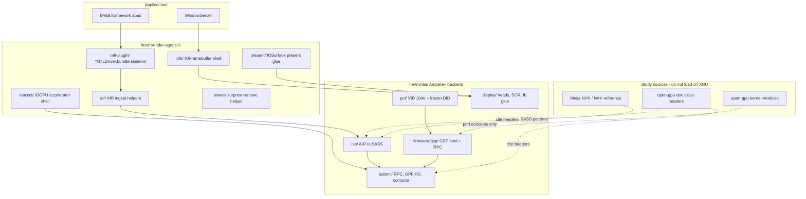

# Nvidia macOS IHV Driver — Implementation Plan

**Role:** Driver maker for Nvidia on macOS (Intel x86 / Hackintosh host)  
**Binding spec:** [CURSOR-START-NVIDIA.md](CURSOR-START-NVIDIA.md)  
**Host contract (pending):** `CURSOR-IHV-DRIVER-SPEC.md`  
**Date:** 30 Aug 2026  
**Status:** Plan only — no driver code implemented yet

---

## 1. Mission

Deliver an unofficial **display + Metal** IHV backend for **Ampere-or-newer** Nvidia GPUs (GA10x first) on Intel x86 Macs where kext loading is already solved. Applications continue using Apple's `Metal.framework` and WindowServer; this project fills `ihv/nvidia/` and plugs into the vendor-agnostic `host/` layer.

**Done means:**

- WindowServer attaches to our `IOFramebuffer` and shows a desktop on the card's HDMI/DP
- `MTLCopyAllDevices()` returns our `MTLDevice`
- A stock `.metallib` compute app runs on **SASS**
- A Metal render app presents via `CAMetalLayer` onto our display

**Explicitly not done:** Kepler/Pascal Web Driver revival, Linux KMD port, Apple Silicon display replacement, SIP/OpenCore recipes.

---

## 2. Current repository state

| Area | Status |
|---|---|
| `docs/CURSOR-START-NVIDIA.md` | Complete — phased plan N0–N6, acceptance criteria, do-nots |
| `ihv/nvidia/` layout | Scaffolded (`.gitkeep` placeholders only) |
| `host/` layout | Scaffolded (no kext shells yet) |
| `CURSOR-IHV-DRIVER-SPEC.md` | **Missing** — host contract referenced but not committed |
| Research corpus (`01-*.md`, `02-*.md`, `03-*.md`, `FINDINGS.md`) | **Missing** |
| Prior `NvidiaMetal50` GOP kext | **Removed** in repo restart (PR #1) — superseded by IHV architecture |

---

## 3. Architecture

**Split rule:** `host/` speaks Apple IOKit/IOGPU contracts. `ihv/nvidia/` boots GSP, programs the display engine, submits Ampere compute classes, and lowers AIR to SASS. Never fork Apple frameworks.

---

## 4. Dependencies and sequencing

### 4.1 Host layer must exist first (or in tight parallel)

Nvidia work cannot ship standalone kexts without the host shells defined in [host/README.md](../host/README.md):

| Host component | Nvidia consumer | Minimum deliverable |
|---|---|---|
| `host/iofb/` | `ihv/nvidia/display/fb/` | `IOFramebuffer` subclass with IHV vtable hooks |
| `host/ioaccel/` | `ihv/nvidia/submit/` | Accelerator kext speaking IOGPU user clients |
| `host/air/` | `ihv/nvidia/isa/air-ingest/` | `.metallib` slice parser, triple validation |
| `host/mtl-plugin/` | Phase 5 bundle wiring | `MetalPluginName` / `MetalPluginClassName` registry |
| `host/present/` | Phase 6 | IOSurface GPU-map + scanout |
| `host/power/` | TB surprise-remove | MSI, `0xFFFFFFFF` yank handling |

**Recommendation:** Trace AMD `AMDRadeonX6000` on Tahoe Intel macOS while building host shells (per README fill order). Nvidia Phase 0–1 can proceed in parallel once host PCI attach + stub IHV compile path exists.

### 4.2 Missing documents to produce before deep implementation

1. **`CURSOR-IHV-DRIVER-SPEC.md`** — host phases P0–P7, bundle ID policy, acceptance tests
2. **`01-metal-userspace.md`** — IOGPU selectors, plugin ABI, `supportsFamily` policy
3. **`02-kernel-boot-display.md`** — WindowServer FB attach, AGDC/GPUWrangler, TB tunnel
4. **`03-nvidia-prior-art.md`** — fossil Web Driver anatomy, TinyGPU limits
5. **`FINDINGS.md`** — living trace log from hardware sessions
6. **`ihv/nvidia/docs/boards.md`** — frozen Phase 0 board record

Until these exist, any UNKNOWN from CURSOR-START-NVIDIA §9 must be recorded in [ihv/nvidia/docs/abi-notes.md](../ihv/nvidia/docs/abi-notes.md) and the affected branch **stopped**.

### 4.3 Hardware and toolchain prerequisites

| Requirement | Notes |
|---|---|
| Intel x86 host | 2019 Mac Pro (MacPro7,1) preferred — internal PCIe, no iGPU |
| One Ampere GPU | GA10x; prefer monolithic SKU (e.g. RTX 3060 / 3070) over multi-die first |
| macOS 26 Tahoe | OS pin per CURSOR-START-NVIDIA §3 |
| Xcode + KDK | x86_64 kext build; kernel private headers for IOGPU |
| GSP firmware | Build-time only; **macOS redistribution UNKNOWN** — blocks N1.4 if unresolved |

Cloud/Linux agents can write source and docs but **cannot compile or load kexts**. Hardware validation requires the user's Mac.

---

## 5. Phased execution plan

Each phase ends with a **stop-and-report** gate. Do not skip phases. Criteria IDs map to CURSOR-START-NVIDIA §6.

### Phase 0 — Freeze (N0 / host P0)

**Goal:** One board, one DID, one OS build, bundle IDs frozen, UNKNOWN list filed.

| Step | Deliverable | Path |
|---|---|---|
| 0.1 | Pick host machine + Ampere card; record `system_profiler` / IORegistry | `ihv/nvidia/docs/boards.md` |
| 0.2 | Freeze exactly one PCI DID in allow-list | `ihv/nvidia/pci/did-allowlist.txt` |
| 0.3 | Document tunnel/MSI notes if TB eGPU | `ihv/nvidia/pci/personalities.md` |
| 0.4 | Snapshot AMD IORegistry on same OS (ABI oracle) | `FINDINGS.md` |
| 0.5 | Freeze project bundle IDs (not `com.apple.*`, not `com.nvidia.web.*`) | host spec + `ihv/nvidia/docs/abi-notes.md` |
| 0.6 | File UNKNOWN list (GSP redistrib, IOGPU selectors, entitlements) | `ihv/nvidia/docs/abi-notes.md` |

**Accept:** P0.1–P0.5 from host spec + one DID in allow-list; Kepler/Pascal explicitly marked out-of-scope.

---

### Phase 1 — Enumerate + firmware alive (N1)

**Goal:** PCI personality attaches; BARs mapped; GSP heartbeats; one RPC no-op completes. No Metal yet.

| Step | Work | Key files |
|---|---|---|
| 1.1 | PCI kext personality: VID `10de` + frozen DID, `IOPCITunnelCompatible` if TB | `ihv/nvidia/pci/`, `host/ioaccel/` or dedicated probe kext |
| 1.2 | Map BARs; read config-space identity from **public** headers only | `ihv/nvidia/pci/` |
| 1.3 | Port GSP boot sequence from open-rm study (not `nvidia.ko` load) | `ihv/nvidia/firmware/gsp/` |
| 1.4 | Load GSP blob from build-time path; log ready state or UNKNOWN+license block | `ihv/nvidia/firmware/` |
| 1.5 | Implement RPC queue + one no-op/identity RPC; log observed class IDs | `ihv/nvidia/submit/rpc/` |
| 1.6 | Optional throwaway PCIDriverKit probe (product path = kext) | out-of-tree test only |

**Accept:** N1.1–N1.5. **N1.6:** `MTLCopyAllDevices` must **not** list us yet.

**Stop conditions:** GSP blob license unresolved; RPC panic; BAR map failure.

---

### Phase 2 — Dumb framebuffer / WindowServer (N2)

**Goal:** `IOFramebuffer` subclass; modeset on card's own HDMI/DP; login desktop visible. Still no Metal.

| Step | Work | Key files |
|---|---|---|
| 2.1 | Wire `host/iofb/` shell to `ihv/nvidia/display/fb/` | `display/fb/`, `host/iofb/` |
| 2.2 | Program display engine: heads, SOR, HDMI/DP link | `display/heads/`, `display/or/` |
| 2.3 | Publish modes; stub cursor + VBL | `display/heads/` |
| 2.4 | Confirm WindowServer user-client attach; capture errors if refused | `FINDINGS.md` |
| 2.5 | Implement **minimum** extra IOFramebuffer methods traces demand | `host/iofb/` |

**Accept:** N2.1–N2.4. Unaccelerated desktop OK. NVDEC unused.

**Stop condition:** WindowServer refuses FB — capture trace, do **not** skip to Metal.

---

### Phase 3 — Non-Metal compute submit (N3)

**Goal:** BO alloc, GSP RPC + Ampere compute class, known byte pattern in mapped buffer.

| Step | Work | Key files |
|---|---|---|
| 3.1 | Device-visible memory alloc/free; CPU map round-trip | `ihv/nvidia/submit/compute/` |
| 3.2 | GPFIFO / channel / doorbell setup | `ihv/nvidia/submit/fifo/` |
| 3.3 | Submit Ampere compute class + QMD (open matching open-gpu-doc header) | `ihv/nvidia/submit/compute/` |
| 3.4 | Reset + TB yank (`0xFFFFFFFF`) hardening | `host/power/` |
| 3.5 | Log all RPC/class IDs in abi-notes with header citations | `ihv/nvidia/docs/abi-notes.md` |

**Accept:** N3.1–N3.4. Still invisible to Metal.

---

### Phase 4 — AIR compile one shader (N4)

**Goal:** Trivial AIR compute shader → SASS → Phase 3 submit. **Metal.framework not in loop.**

| Step | Work | Key files |
|---|---|---|
| 4.1 | Parse `.air` / `.metallib` slice via `host/air/` | `isa/air-ingest/` |
| 4.2 | AIR → SASS backend for Ampere (NAK study, not port) | `isa/sass/` |
| 4.3 | Owned test shader + expected buffer | `isa/samples/` |
| 4.4 | End-to-end: compile → submit → verify buffer | integration test on Mac |

**Accept:** N4.1–N4.4. No `MTLCopyAllDevices` change.

**Risk:** AIR→SASS is net-new work; NAK ingests NIR, not AIR. Fallback: compile inside `*MTLDriver.bundle` at PSO time if `CompilerPluginInterface` cannot register (UNKNOWN until measured).

---

### Phase 5 — MTLDevice (N5)

**Goal:** Our `*MTLDriver.bundle` loaded; tiny Metal compute app runs on the card.

| Step | Work | Key files |
|---|---|---|
| 5.1 | Accelerator registry: `MetalPluginName` → our bundle | `host/mtl-plugin/`, `host/ioaccel/` |
| 5.2 | Implement IOGPU user clients traced from AMD X6000 oracle | `host/ioaccel/` |
| 5.3 | `makeLibrary` → compute PSO → `commit` → `MTLBuffer` result | bundle + `isa/` |
| 5.4 | Honest `supportsFamily` (under-claim until render proven) | bundle metadata |

**Accept:** N5.1–N5.5.

---

### Phase 6 — Present (N6)

**Goal:** Metal render + present on Phase 2 framebuffer.

| Step | Work | Key files |
|---|---|---|
| 6.1 | `CAMetalLayer` drawable = IOSurface-backed on our device | `host/present/` |
| 6.2 | GPU-map IOSurface into card VA; scanout composite | `ihv/nvidia/submit/copy/`, `display/` |
| 6.3 | On-screen triangle / clear color via WindowServer | integration test |
| 6.4 | `CGDirectDisplayCopyCurrentMetalDevice` returns our device | verification |

**Accept:** N6.1–N6.4.

---

### Phase 7 — Generation expansion (post-Ampere)

After N4–N6 green on GA10x:

- Append Ada Lovelace DIDs to `did-allowlist.txt`
- Add generation tables in `isa/sass/` (QMD layout, surface kind)
- Blackwell gated behind Ampere P4 green — do not pre-implement GB20x ISA

Same IHV backend slot; no `host/` rewrite.

---

## 6. Immediate work queue (first sprint)

Ordered for a coding agent starting today:

1. **Add `CURSOR-IHV-DRIVER-SPEC.md` stub** — even a skeleton unblocks host/IHV contract references
2. **Phase 0 board freeze** — user must supply hardware; agent prepares `boards.md` template + `did-allowlist.txt` placeholder
3. **Build system scaffold** — x86_64 kext Makefile/Xcode project for `host/` + stub IHV link
4. **`ihv/nvidia/pci/personalities.md`** — document match keys, probe score policy, tunnel notes
5. **Clone open-gpu-kernel-modules @ 610.57.04** as external reference (not submodule load on XNU); map `src/nvidia/src/kernel/gpu/gsp/` for Phase 1 study
6. **GSP license research** — document outcome in `firmware/README.md`; stop N1.4 if blocked
7. **AMD trace session on Tahoe** — populate `FINDINGS.md` with IOGPU selectors, `MetalPluginClassName`, registry keys (parallel AMD track accelerates this)

---

## 7. Risk register

| Risk | Impact | Mitigation |
|---|---|---|
| GSP firmware macOS redistribution UNKNOWN | Blocks Phase 1 | Legal review; build-time local blobs only; stop-and-report |
| AIR→SASS net-new compiler | Blocks Phase 4–5 | Start with trivial kernel; study NAK SASS emission; offline path before MTLDevice |
| IOGPU ABI undocumented | Blocks Phase 5 | Trace AMD X6000 on pinned Tahoe; no invented selectors |
| `IOGraphicsFamily` KPI status on Tahoe SDK | Blocks Phase 2 | Re-read Apple deprecated-kext policy; measure attach |
| No live Nvidia Metal plugin to trace | Higher Phase 5 cost | AMD oracle for IOGPU; open-rm for hardware; historical GeForce bundle for shape only |
| Linux cloud agent environment | Cannot build/load kexts | Mac hardware sessions for all acceptance tests |
| WindowServer FB rejection | Blocks Phase 2 | Trace minimum IOFramebuffer methods; no Metal shortcut |
| TB `0xFFFFFFFF` surprise-remove | Panic on eGPU | Prefer internal PCIe Phase 1; MSI; power helper |

---

## 8. Do-nots (enforced)

From CURSOR-START-NVIDIA §8 — summary for implementers:

- Do not load `nvidia.ko` / Nouveau / Nova on XNU
- Do not WhateverGreen-spoof IDs or AGDP board-ids
- Do not fork `Metal.framework`, `IOGPU.framework`, WindowServer
- Do not write SIP/OpenCore/AuxKC loading recipes
- Do not revive Web Drivers, CUDA 10.2, or Kepler bundles
- Do not bit-bang 3D engine to skip GSP
- Do not invent RPC IDs, IOGPU selectors, or plugin vtables

---

## 9. Success metrics by phase

| Phase | Proof artifact |
|---|---|
| N0 | `boards.md` + one-line `did-allowlist.txt` + UNKNOWN list |
| N1 | Kernel log: GSP ready + RPC no-op; IORegistry: our IOClass on `10de:xxxx` |
| N2 | Photo/video: login window on card's monitor; `ioreg` FB node |
| N3 | Hex dump: expected pattern in device buffer after compute submit |
| N4 | Same as N3 but shader compiled from owned `.metallib` |
| N5 | `MTLCopyAllDevices` screenshot + compute app stdout |
| N6 | On-screen rendered triangle; `CGDirectDisplayCopyCurrentMetalDevice` match |

---

## 10. References

- [CURSOR-START-NVIDIA.md](CURSOR-START-NVIDIA.md) — binding Nvidia IHV spec
- [README.md](../README.md) — repo overview and fill order
- [ihv/nvidia/README.md](../ihv/nvidia/README.md) — directory map
- [host/README.md](../host/README.md) — host layer contract
- [NVIDIA open-gpu-kernel-modules](https://github.com/NVIDIA/open-gpu-kernel-modules) — GSP/RM study (610.57.04)
- [NVIDIA open-gpu-doc](https://nvidia.github.io/open-gpu-doc/) — Ampere class headers

---

*Nvidia IHV implementation plan. Host-wide phases live in `CURSOR-IHV-DRIVER-SPEC.md` when added. If a claim is not cited in CURSOR-START-NVIDIA or opened headers, treat it as UNKNOWN.*
